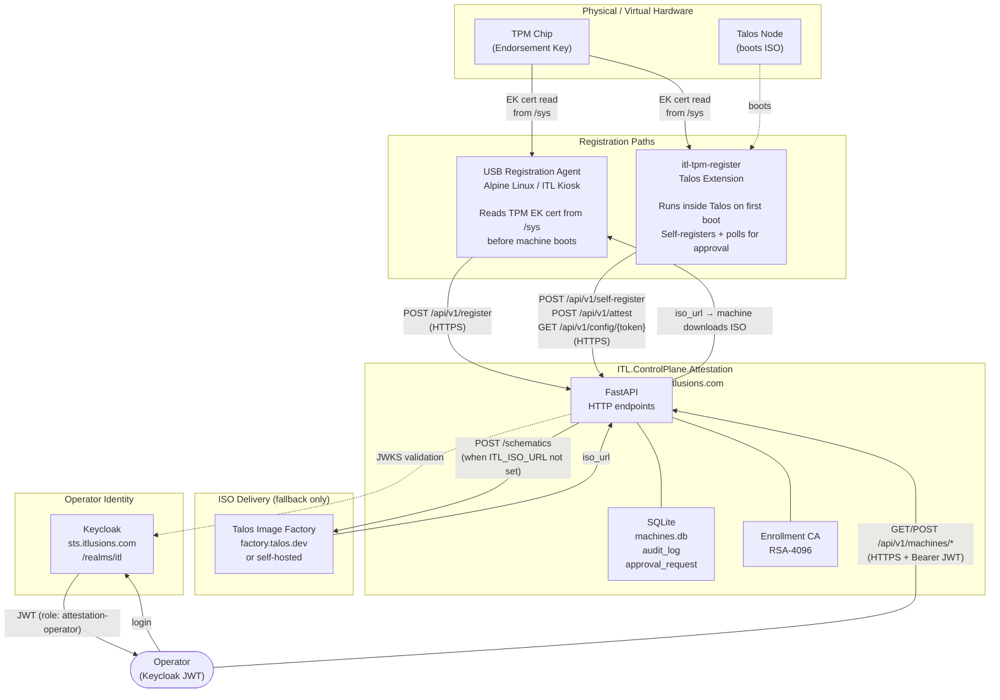
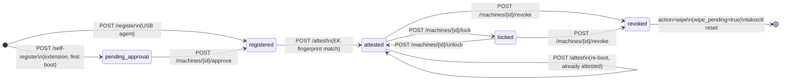
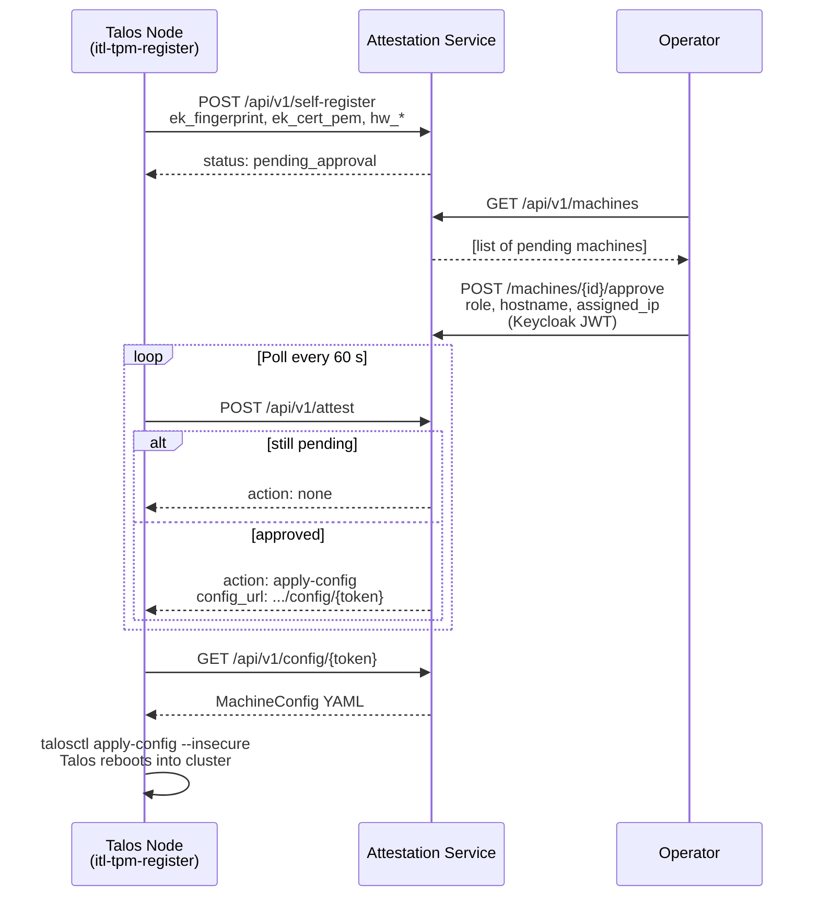
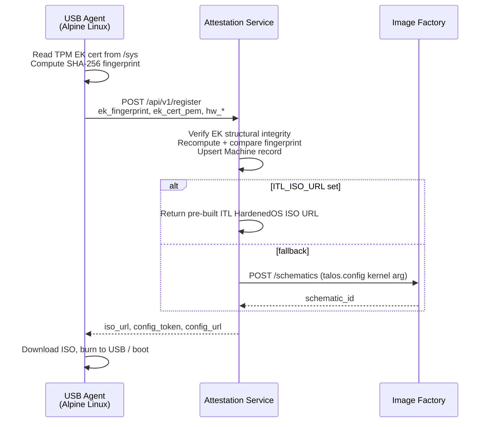
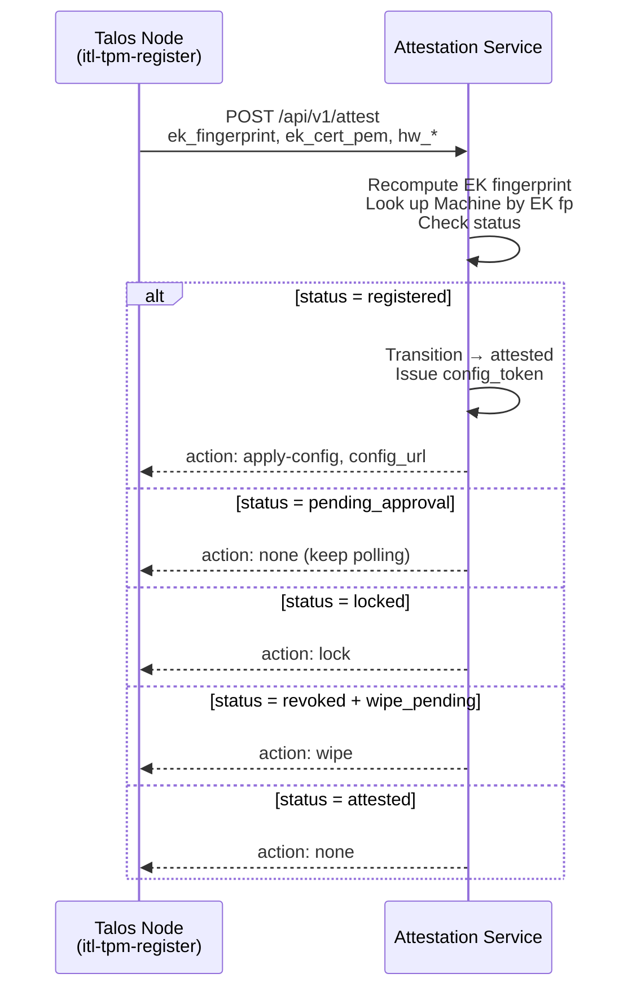
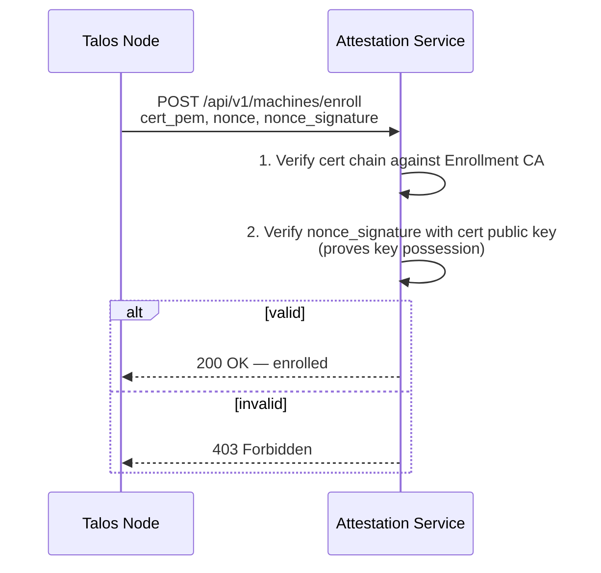

# Architecture — ITL.ControlPlane.Attestation

## Purpose

The Attestation Service is the hardware trust broker for the ITL Control Plane. It answers a single core question for every node that boots:

> "Is this the physical machine we expect, and is it authorised to join the cluster?"

It does this by anchoring machine identity to the TPM Endorsement Key (EK) — a hardware-bound asymmetric key that cannot be migrated or cloned. Machines register before deployment, boot a signed Talos ISO, and are admitted (or rejected) by an operator before receiving cluster credentials.

---

## System Context



---

## Source Layout

```
src/attestation/
  core/
    config.py           — Settings (Pydantic BaseSettings) + settings singleton; includes OIDC + dual-control vars
    deps.py             — FastAPI dependency injectors: get_db(), get_engine(), resolve_operator() (OIDC → mTLS → break-glass)
    app.py              — create_app() factory + lifespan (DB init, CA init)
  models/
    machine.py          — MachineRow SQLModel table + NodeRole / MachineStatus enums
    operator.py         — AuditLogRow (append-only audit log) + ApprovalRequestRow (dual-control pending votes)
  schemas/
    requests.py         — Pydantic request schemas (RegisterRequest, AttestRequest, etc.)
    responses.py        — Pydantic response schemas (AttestResponse, MachineDetail, CertResponse, PendingApprovalResponse, AuditLogEntry, etc.)
  pki/
    enrollment_ca.py    — Enrollment CA: init, cert issuance, chain verification, nonce signature, RSA-OAEP wrapping
    tpm_verifier.py     — EK material structural verification and SHA-256/SHA-384 fingerprint computation
    quote_verifier.py   — TPM2_Quote signature + TPMS_ATTEST parsing + PCR digest verification (issue #6)
    nonce_store.py      — In-memory server-side nonce store with 60-second TTL (issue #7)
    oidc.py             — Keycloak OIDC JWT validation: JWKS fetch + cache, signature verify, role check, operator CN extraction
  repositories/
    machine_repo.py     — SqlMachineRepository: CRUD operations over MachineRow
    operator_repo.py    — AuditRepository (INSERT-only) + ApprovalRepository (dual-control vote store)
  talos/
    config_generator.py — Merge role base configs with machine-specific overrides → Talos MachineConfig YAML
    iso_factory.py      — Build Talos Image Factory schematic URLs; ITL_ISO_URL fallback
  handlers/
    registration.py     — Business logic for /register and /self-register
    attestation.py      — Business logic for /attest
    config_delivery.py  — Business logic for /config/{token} and /config?mac=
    machines.py         — Business logic for machine CRUD, approve (incl. dual-control), revoke, lock, unlock, offline-bundle; all actions write AuditLogRow
    enrollment.py       — Business logic for /machines/enroll and /machines/{id}/request-cert
  routes/
    registration.py     — FastAPI router: POST /api/v1/register, /self-register
    attestation.py      — FastAPI router: GET /healthz, GET /api/v1/attest/challenge, POST /api/v1/attest
    config.py           — FastAPI router: GET /api/v1/config, /api/v1/config/{token}
    machines.py         — FastAPI router: GET/POST /api/v1/machines/**, GET /api/v1/machines/{id}/approvals
    audit.py            — FastAPI router: GET /api/v1/audit (paginated append-only audit log)
  main.py               — Entry point: app = create_app()
```

Backward-compatible re-export shims at the package root (`config.py`, `deps.py`, `models.py`, `app.py`, `enrollment_ca.py`, `tpm_verifier.py`, `config_generator.py`, `iso_factory.py`) allow existing import paths to continue working without changes.

---

## Data Model

### Machine record (`machines` table)

| Field | Type | Description |
|---|---|---|
| `machine_id` | UUID v4 | Stable logical identifier assigned at registration |
| `ek_fingerprint` | SHA-256 hex (64 chars) | Primary hardware identity — SHA-256 of raw EK cert/pub bytes |
| `ek_source` | `cert` \| `pub` | Which TPM EK material was presented |
| `hw_uuid`, `hw_mac`, `hw_serial`, `hw_product` | string | SMBIOS hardware identity fields (secondary; EK fp is canonical) |
| `role` | `controlplane` \| `worker-infra` \| `worker-app` | Assigned Talos node role |
| `status` | enum (see below) | Current lifecycle state |
| `hostname`, `assigned_ip` | optional string | Set by operator at approval |
| `config_token` | random URL-safe token | One-time token for Talos config fetch |
| `token_consumed` | bool | True after first successful config fetch |
| `wipe_pending` | bool | When True + status=revoked, next attest triggers talosctl reset |
| `ak_pub` | SubjectPublicKeyInfo PEM | AK public key registered via `POST /machines/{id}/ak-activate`; null until AK is activated |

### Audit log (`audit_log` table)

Append-only — no UPDATE or DELETE is ever issued against this table. Every admin action writes one row.

| Field | Type | Description |
|---|---|---|
| `id` | integer PK | Auto-increment |
| `timestamp` | datetime (UTC) | When the action occurred |
| `operator_cn` | string | Keycloak `preferred_username`, mTLS cert `CN`, or `"SYSTEM"` (break-glass) |
| `action` | string | `approve`, `approve_vote`, `revoke`, `lock`, `unlock`, `offline_bundle`, `import` |
| `machine_id` | optional string | Machine affected (null for service-level events) |
| `prev_state` | optional string | Machine status before the action |
| `new_state` | optional string | Machine status after the action (null for vote-only events) |
| `detail` | optional string | Free-text note / reason supplied by operator |

### Approval requests (`approval_request` table)

Stores pending dual-control approval votes. The second operator's `approve` call checks for an active (non-expired, non-consumed) row from a **different** operator.

| Field | Type | Description |
|---|---|---|
| `id` | integer PK | Auto-increment |
| `machine_id` | string (indexed) | Machine being approved |
| `operator_cn` | string | First operator's identity |
| `role` | string | Role requested in the first vote |
| `hostname`, `assigned_ip` | optional string | Approval parameters from the first vote |
| `created_at` | datetime (UTC) | When the vote was cast |
| `expires_at` | datetime (UTC) | After this time the vote is ignored |
| `consumed` | bool | Set to `true` once the second approval completes |

### Machine status state machine



When `status=revoked` and `wipe_pending=True`, the next `POST /attest` response includes `"action": "wipe"`. The `itl-tpm-register` Talos extension calls `talosctl reset --graceful=false` on receipt, wiping STATE + EPHEMERAL before rebooting to maintenance mode.

---

## Extension Self-Registration Flow (No USB Agent)

When a machine boots a generic Talos ISO with `talos.config=https://attest.itlusions.com/api/v1/config` baked in, the `itl-tpm-register` extension can self-register without any USB agent pre-step.



The `action` field in `AttestResponse`:

| `action` | Meaning |
|---|---|
| `"none"` | Still pending or already attested — no action needed |
| `"apply-config"` | Machine just attested; fetch `config_url` and apply with `talosctl apply-config --insecure` |
| `"wipe"` | Machine revoked with `wipe_pending=true`; extension calls `talosctl reset --graceful=false` |
| `"lock"` | Machine temporarily locked; extension halts and logs |

---

## Registration Flow (USB Agent)



---

## Attestation Flow (First Talos Boot)



---

## Config Delivery

### Token-based (pre-registered machines)

The registration response includes a `config_url`:
```
https://attest.itlusions.com/api/v1/config/<token>
```

This URL is baked into the Talos ISO schematic via the Talos Image Factory kernel argument `talos.config=<url>`. Talos fetches it on first boot. The token is consumed after the first successful fetch (but re-fetchable on reboot).

### MAC-based (generic ISO / unknown machines)

A single generic Talos ISO can be deployed with:
```
talos.config=https://attest.itlusions.com/api/v1/config
```

Talos appends `?mac=<hw_mac>` automatically. The service looks up the MAC, returns the full machineconfig for attested machines, or a safe pending config (no cluster secrets) for all others.

---

## MachineConfig Generation

Role base configs (`controlplane-final.yaml`, `worker-infra-final.yaml`, `worker-app-final.yaml`) are pre-generated by the ITL.Talos.HardenedOS CI pipeline and stored at `ITL_CONFIG_CACHE_DIR` (default: `/var/lib/itl-reg/configs`).

The service merges machine-specific overrides on top:

| Override | Source |
|---|---|
| `machine.network.hostname` | Set by operator at approval |
| `machine.network.interfaces[0].addresses` | `assigned_ip` at approval |
| `machine.nodeLabels["itl.io/machine-id"]` | `machine_id` |
| `machine.nodeLabels["itl.io/tpm-ek"]` | First 16 chars of EK fingerprint |
| `machine.nodeAnnotations["itl.io/tpm-ek-full"]` | Full EK fingerprint |
| `machine.files` | Enrollment cert + key (offline bundles only) |

---

## Enrollment PKI

### CA

A self-signed RSA-4096 CA is auto-generated on first startup and persisted at `ITL_ENROLLMENT_CA_DIR` (default: `/var/lib/itl-reg/ca/`). It is valid for 10 years.

### Enrollment Certificates

Short-lived RSA-2048 certs are issued to machines that request them. The cert encodes:

| Field | Value |
|---|---|
| `CN` | `machine_id` |
| `OU` | `role` |
| `Key Usage` | `digitalSignature`, `keyEncipherment` |
| `EKU` | `clientAuth` |
| `URI SAN` | `urn:itl:ek:<ek_fingerprint>` |

The URI SAN binds the cert to the specific TPM hardware identity.

### Two-step enrollment challenge



### Key wrapping (optional)

If the machine presents a TPM-resident RSA wrapping key (`wrapping_key_pem`), the service encrypts the enrollment private key with RSA-OAEP-SHA256 before returning it. The private key never travels in plaintext — it is decrypted inside the TPM:

```sh
tpm2_rsadecrypt --key-context wrapping.ctx --input enrollment.key.enc --output enrollment.key
```

---

## Technology Stack

| Component | Technology |
|---|---|
| Web framework | FastAPI 0.115+ |
| ORM + schema | SQLModel 0.0.21+ (SQLAlchemy + Pydantic v2) |
| Database | SQLite (single-file, volume-mounted) |
| Cryptography | `cryptography` 43+ |
| HTTP client | `httpx` 0.28+ (Talos Image Factory calls) |
| Config serialisation | PyYAML 6.0+ |
| Runtime | Python 3.12+, Uvicorn 2 workers |
| Container | python:3.12-slim |

---

## Known Limitations

The following security gaps are tracked as GitHub issues:

| Issue | Gap | Status |
|---|---|---|
| [#1](https://github.com/ITlusions/ITL.ControlPlane.Attestation/issues/1) | EK PEM verified by header-sniff only — needs real X.509 parse | Open |
| [#2](https://github.com/ITlusions/ITL.ControlPlane.Attestation/issues/2) | Registration accepted without EK material (self-reported fingerprint) | Open |
| [#3](https://github.com/ITlusions/ITL.ControlPlane.Attestation/issues/3) | Manufacturer CA chain verification is stubbed — not implemented | Open (opt-in via `ITL_TPM_VERIFY_CA`) |
| [#4](https://github.com/ITlusions/ITL.ControlPlane.Attestation/issues/4) | Enrollment does not cross-check EK fingerprint from cert URI SAN | Open |
| [#6](https://github.com/ITlusions/ITL.ControlPlane.Attestation/issues/6) | PCR quote verification — AK activation and quote verification implemented; PCR policy enforcement optional | Partially implemented |
| [#7](https://github.com/ITlusions/ITL.ControlPlane.Attestation/issues/7) | Nonce-based anti-replay for attestation — server-side nonce store implemented; enforcement opt-in via `ITL_REQUIRE_NONCE` | Partially implemented |
| Per-operator identity + audit trail | Single shared admin token provided no accountability | **Fixed** — Keycloak OIDC per-operator auth + append-only audit log |
| Dual-control for critical roles | Single operator could unilaterally approve controlplane nodes | **Fixed** — `ITL_DUAL_CONTROL_ROLES` enforces 2-of-N quorum |

See [SECURITY.md](SECURITY.md) for full threat model and mitigations.
