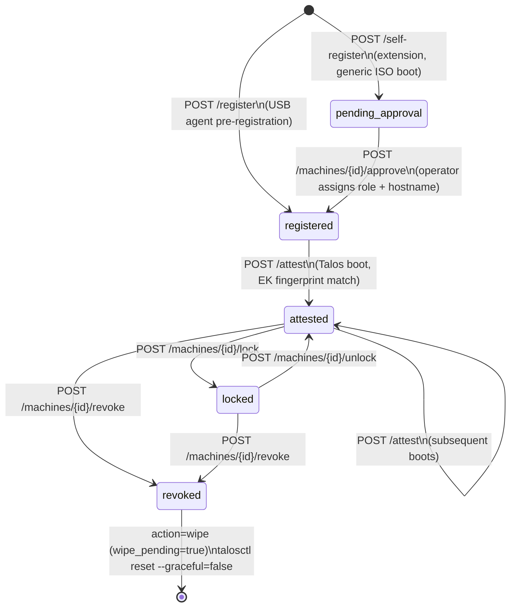

# Operations — ITL.ControlPlane.Attestation

## Operator Authentication

### Option 1: CLI (Recommended)

The ITL Attestation CLI handles OIDC authentication automatically:

```sh
# Interactive browser login (PKCE)
attestation auth login

# View current user
attestation auth whoami

# Logout
attestation auth logout
```

All subsequent CLI commands automatically use the cached token.

### Option 2: Manual Token Fetch (for curl/scripting)

Obtain a Keycloak JWT manually:

```sh
TOKEN=$(curl -s -X POST \
  "https://sts.itlusions.com/realms/itl/protocol/openid-connect/token" \
  -d "grant_type=password" \
  -d "client_id=attestation-service" \
  -d "username=$OPERATOR_USER" \
  -d "password=$OPERATOR_PASS" \
  | jq -r .access_token)
```

All subsequent curl examples use `$TOKEN`. For emergency break-glass access use `$ITL_ADMIN_TOKEN` instead — all such actions are logged as `operator_cn = SYSTEM`.

---

## Machine Lifecycle Overview



---

## Common Operator Workflows

### 0. Zero-touch registration via Talos extension (no USB agent)

This is the fully automated path when machines boot a generic Talos ISO that has `talos.config=https://attest.itlusions.com/api/v1/config` in its kernel arguments.

**What the extension does automatically:**
1. Calls `POST /api/v1/self-register` on first boot → machine appears as `pending_approval`
2. Polls `POST /api/v1/attest` every 60 seconds
3. When the operator approves, the next poll returns `action=apply-config` + `config_url`
4. Extension runs `talosctl apply-config --insecure --file <(curl -sf <config_url>)`
5. Talos reboots into the cluster

**Operator action required:**

**CLI (recommended):**
```sh
# 1. See pending machines
attestation machine list --status pending_approval

# 2. Approve (extension picks this up within 60 s)
attestation machine approve <machine-id> \
  --role worker-app \
  --hostname k8s-worker-03 \
  --assigned-ip 10.0.1.13/24 \
  --reason "Production deployment"
```

**curl (alternative):**
```sh
# 1. See pending machines
curl -s -H "Authorization: Bearer $TOKEN" \
  https://attest.itlusions.com/api/v1/machines \
  | jq '[.[] | select(.status == "pending_approval")]'

# 2. Approve (extension picks this up within 60 s)
curl -s -X POST \
  -H "Authorization: Bearer $TOKEN" \
  -H "Content-Type: application/json" \
  -d '{"role": "worker-app", "hostname": "k8s-worker-03", "assigned_ip": "10.0.1.13/24"}' \
  https://attest.itlusions.com/api/v1/machines/<machine_id>/approve
```

No reboot required from the operator — the extension handles it automatically once approved.

---

### 0b. Dual-control approval for controlplane nodes

When `ITL_DUAL_CONTROL_ROLES=controlplane`, a single approval is not sufficient. Two distinct operators must approve independently within `ITL_DUAL_CONTROL_WINDOW_SECONDS` (default 10 min).

**CLI (recommended):**
```sh
# Operator 1 (alice) — first vote → pending second approval
attestation auth login  # Alice logs in
attestation machine approve <machine-id> \
  --role controlplane \
  --hostname cp-01 \
  --assigned-ip 10.0.0.1/24 \
  --reason "First approval - Alice"
# → Status: pending_second_approval (1/2 approvals)

# Operator 2 (bob) — second vote → machine registered
attestation auth logout
attestation auth login  # Bob logs in
attestation machine approve <machine-id> \
  --role controlplane \
  --hostname cp-01 \
  --assigned-ip 10.0.0.1/24 \
  --reason "Second approval - Bob"
# → Status: registered (2/2 approvals)
```

**curl (alternative):**
```sh
# Operator 1 (alice) — first vote → HTTP 202
curl -s -X POST \
  -H "Authorization: Bearer $ALICE_TOKEN" \
  -H "Content-Type: application/json" \
  -d '{"role": "controlplane", "hostname": "cp-01", "assigned_ip": "10.0.0.1/24"}' \
  https://attest.itlusions.com/api/v1/machines/<machine_id>/approve
# → {"status": "pending_second_approval", "approvals_received": 1, "approvals_required": 2, ...}

# Operator 2 (bob) — second vote → HTTP 200 (must be a different identity)
curl -s -X POST \
  -H "Authorization: Bearer $BOB_TOKEN" \
  -H "Content-Type: application/json" \
  -d '{"role": "controlplane", "hostname": "cp-01", "assigned_ip": "10.0.0.1/24"}' \
  https://attest.itlusions.com/api/v1/machines/<machine_id>/approve
# → MachineDetail (machine is now registered)
```

**CLI:**
```sh
attestation machine get <machine-id> --output json | jq .approvals
```

**curl:**
```sh
curl -s -H "Authorization: Bearer $TOKEN" \
  https://attest.itlusions.com/api/v1/machines/<machine_id>/approvals | jq .
```

**Step 1** — Run the USB registration agent on the physical machine. The agent reads the TPM EK cert, calls `POST /api/v1/register`, and writes the returned ISO URL to screen. Boot the machine from the returned ISO.

**Step 2** — List pending machines:

**CLI:**
```sh
attestation machine list --status pending_approval
attestation machine list --status registered
```

**curl:**
```sh
curl -s -H "Authorization: Bearer $TOKEN" \
  https://attest.itlusions.com/api/v1/machines \
  | jq '.[] | select(.status == "pending_approval" or .status == "registered")'
```

**Step 3** — Approve and assign role:

**CLI:**
```sh
attestation machine approve <machine-id> \
  --role worker-app \
  --hostname k8s-worker-03 \
  --assigned-ip 10.0.1.13/24
```

**curl:**
```sh
curl -s -X POST \
  -H "Authorization: Bearer $TOKEN" \
  -H "Content-Type: application/json" \
  -d '{"role": "worker-app", "hostname": "k8s-worker-03", "assigned_ip": "10.0.1.13/24"}' \
  https://attest.itlusions.com/api/v1/machines/<machine_id>/approve
```

**Step 4** — Machine boots, `POST /api/v1/attest` is called by the Talos extension, status transitions to `attested`. The machine fetches its MachineConfig via `GET /api/v1/config/<token>` and joins the cluster.

---

### 2. First-boot attestation without USB pre-registration

If a machine boots a generic Talos ISO (with `talos.config=https://attest.itlusions.com/api/v1/config` in kernel args), the extension calls `POST /api/v1/attest` on first boot. The machine is created automatically as `pending_approval`.

The operator then reviews and approves as in Step 2–3 above. The machine must **reboot** to re-attest and receive its approved config.

---

### 3. Lock a machine temporarily

Useful when a machine needs to be pulled for maintenance but you want to prevent it from re-joining the cluster:

**CLI:**
```sh
attestation machine lock <machine-id> --reason "Scheduled maintenance — disk replacement"
```

**curl:**
```sh
curl -s -X POST \
  -H "Authorization: Bearer $TOKEN" \
  -H "Content-Type: application/json" \
  -d '{"reason": "Scheduled maintenance — disk replacement"}' \
  https://attest.itlusions.com/api/v1/machines/<machine_id>/lock
```

The machine's next attestation attempt returns `action=lock`. No data is destroyed. Unlock when ready:

**CLI:**
```sh
attestation machine unlock <machine-id>
```

**curl:**
```sh
curl -s -X POST \
  -H "Authorization: Bearer $TOKEN" \
  https://attest.itlusions.com/api/v1/machines/<machine_id>/unlock
```

---

### 4. Revoke a machine (no wipe)

Blocks the machine from re-attesting without destroying any data. Use when decommissioning a node gracefully or when suspending access pending investigation:

**CLI:**
```sh
attestation machine revoke <machine-id> --reason "Decommissioned — replaced by k8s-worker-07"
```

**curl:**
```sh
curl -s -X POST \
  -H "Authorization: Bearer $TOKEN" \
  -H "Content-Type: application/json" \
  -d '{"wipe": false, "reason": "Decommissioned — replaced by k8s-worker-07"}' \
  https://attest.itlusions.com/api/v1/machines/<machine_id>/revoke
```

---

### 5. Revoke a machine with remote wipe

Triggers a `talosctl reset --graceful=false` on the node the next time it contacts the attestation service. This wipes STATE and EPHEMERAL partitions, destroying cluster join credentials and returning the node to maintenance mode.

**CLI:**
```sh
attestation machine revoke <machine-id> --reason "Security incident — node suspected compromised"
```

**curl:**
```sh
curl -s -X POST \
  -H "Authorization: Bearer $TOKEN" \
  -H "Content-Type: application/json" \
  -d '{"wipe": true, "reason": "Security incident — node suspected compromised"}' \
  https://attest.itlusions.com/api/v1/machines/<machine_id>/revoke
```

The wipe is triggered the next time the `itl-tpm-register` extension calls `POST /api/v1/attest`. If the node is offline, the wipe will execute on next boot.

---

### 6. Generate an offline USB bundle

For air-gapped deployments where the machine cannot reach the service during initial setup:

**CLI:**
```sh
attestation machine get <machine-id> --output json | jq .offline_bundle
```

**curl:**
```sh
curl -s -H "Authorization: Bearer $TOKEN" \
  https://attest.itlusions.com/api/v1/machines/<machine_id>/offline-bundle \
  | jq .
```

The bundle contains the ISO URL, config token, and a full MachineConfig YAML with the enrollment cert and key embedded as Talos file entries. The node self-enrolls on first boot by signing a nonce with the embedded private key.

Write the `machineconfig` field to a file and place it on the USB alongside the ISO:

```sh
curl -s -H "Authorization: Bearer $TOKEN" \
  https://attest.itlusions.com/api/v1/machines/<machine_id>/offline-bundle \
  | jq -r '.machineconfig' > machineconfig.yaml
```

---

### 7. Import a machine from a TPM receipt

The USB agent in offline mode writes a "TPM receipt" JSON file containing EK material and hardware identity. Import it:

```sh
curl -s -X POST \
  -H "Authorization: Bearer $TOKEN" \
  -H "Content-Type: application/json" \
  -d @tpm-receipt.json \
  https://attest.itlusions.com/api/v1/machines/import
```

The machine is created in `registered` state. Approve it before the node is booted.

---

## Monitoring

### Health check

```sh
curl -sf https://attest.itlusions.com/healthz
# → {"status": "ok"}
```

### Machine status counts

**CLI:**
```sh
attestation machine list --output json | jq 'group_by(.status) | map({status: .[0].status, count: length})'
```

**curl:**
```sh
curl -s -H "Authorization: Bearer $TOKEN" \
  https://attest.itlusions.com/api/v1/machines \
  | jq 'group_by(.status) | map({status: .[0].status, count: length})'
```

### Machines requiring approval

**CLI:**
```sh
attestation machine list --status pending_approval
```

**curl:**
```sh
curl -s -H "Authorization: Bearer $TOKEN" \
  https://attest.itlusions.com/api/v1/machines \
  | jq '[.[] | select(.status == "pending_approval")]'
```

### Audit log

**CLI:**
```sh
# Most recent 50 admin actions
attestation audit list --page 1 --per-page 50

# Verify cryptographic chain integrity
attestation audit verify

# Filter to a specific machine
attestation audit list --machine-id <machine-id>
```

**curl:**
```sh
# Most recent 50 admin actions
curl -s -H "Authorization: Bearer $TOKEN" \
  "https://attest.itlusions.com/api/v1/audit?page=1&per_page=50" | jq .

# Filter to a specific machine
curl -s -H "Authorization: Bearer $TOKEN" \
  "https://attest.itlusions.com/api/v1/audit" \
  | jq '[.[] | select(.machine_id == "<machine_id>")]'
```

The log is append-only — entries are never modified or deleted. `operator_cn` is `"SYSTEM"` for break-glass token actions.

### Pending dual-control approvals

**CLI:**
```sh
attestation machine get <machine-id> --output json | jq .approvals
```

**curl:**
```sh
curl -s -H "Authorization: Bearer $TOKEN" \
  https://attest.itlusions.com/api/v1/machines/<machine_id>/approvals | jq .
```

---

## Log Reference

The service uses structured logging (format: `timestamp  LEVEL  logger — message`). Key log events:

| Event | Level | Message pattern |
|---|---|---|
| New machine registered | INFO | `New machine registered: id=... role=... ek=...` |
| Machine re-registered | INFO | `Re-registration of machine ... (ek=...)` |
| Machine attested | INFO | `Machine attested: id=... role=...` |
| Attestation from unknown EK | WARNING | `Attestation from unknown EK ...` |
| Locked machine contact | WARNING | `Locked machine contacted: id=...` |
| Revoked machine contact | WARNING | `Revoked machine contacted: id=... action=...` |
| Config token consumed | INFO | `Config token consumed for machine ...` |
| Config re-fetch | INFO | `Config re-fetch for machine ... (token already consumed)` |
| Factory unreachable | ERROR | `Talos Image Factory unreachable: ...` |
| Enrollment cert issued | INFO | `Enrollment cert issued: machine_id=... role=... serial=... valid_days=...` |
| CA generated | INFO | `Enrollment CA generated (serial=...)` |
| CA loaded | INFO | `Enrollment CA loaded from ... (serial=...)` |

---

## Backup and Recovery

### What to back up

| Path | Contents | Criticality |
|---|---|---|
| `/var/lib/itl-reg/ca/` | Enrollment CA key + cert | Critical — losing this invalidates all enrollment certs |
| `/var/lib/itl-reg/db/machines.db` | Machine registry | High — losing this requires re-registration of all machines |
| `/var/lib/itl-reg/configs/` | Role base config YAMLs | Medium — can be re-downloaded from GitHub Release |

### SQLite backup

```sh
# Live backup (safe while service is running)
sqlite3 /var/lib/itl-reg/db/machines.db ".backup '/backup/machines-$(date +%Y%m%d).db'"
```

### CA key backup

```sh
cp /var/lib/itl-reg/ca/enrollment-ca.key /secure-backup/enrollment-ca.key
cp /var/lib/itl-reg/ca/enrollment-ca.crt /secure-backup/enrollment-ca.crt
```

Store the CA key in an encrypted vault. Anyone who obtains it can forge enrollment certs for any registered machine ID.

---

## CNSA 1.0 Cryptographic Migration Guide (issue #8)

This section describes the one-time steps required when upgrading to a release that implements **CNSA 1.0 cryptographic hardening**.

### What changed

| Component | Before | After |
|---|---|---|
| Enrollment CA key | RSA-4096 (default) | ECDSA P-384 (new default) |
| Enrollment cert key | RSA-2048 | ECDSA P-384 |
| EK fingerprint hash | SHA-256 (64 hex chars) | SHA-384 (96 hex chars) |
| Nonce signing hash | SHA-256 | SHA-384 (ECDSA certs) |

### Step 1 — Back up current state

```sh
sqlite3 /var/lib/itl-reg/db/machines.db ".backup '/backup/machines-pre-cnsa.db'"
cp /var/lib/itl-reg/ca/enrollment-ca.key /secure-backup/enrollment-ca-rsa.key
cp /var/lib/itl-reg/ca/enrollment-ca.crt /secure-backup/enrollment-ca-rsa.crt
```

### Step 2 — Run the SHA-384 fingerprint migration

The migration script adds the `ek_fingerprint_sha384` column to the `machine` table and populates it for all rows that have a stored EK certificate.

```sh
# If running in Docker
docker exec <container> python migrations/001_add_ek_fingerprint_sha384.py

# If running directly
python migrations/001_add_ek_fingerprint_sha384.py /var/lib/itl-reg/db/machines.db
```

The script is **idempotent** — safe to re-run.  Machines without a stored EK cert (`ek_cert_pem IS NULL`) will be skipped and must re-attest to populate the column.

### Step 3 — Rotate the Enrollment CA to ECDSA P-384

The existing RSA CA continues to be loaded from disk until you delete it.  To rotate to a new ECDSA P-384 CA:

```sh
# Remove the old CA key + cert (service auto-generates a new one on restart)
rm /var/lib/itl-reg/ca/enrollment-ca.key
rm /var/lib/itl-reg/ca/enrollment-ca.crt

# Restart the service (new ECDSA P-384 CA is generated)
docker compose restart attestation
# or: systemctl restart itl-attestation
```

> **Warning**: All outstanding enrollment certs signed by the old RSA CA become invalid after rotation.  Re-generate offline bundles for any machine that has not yet enrolled.

### Step 4 — Enable high-assurance TLS (optional but recommended)

Set `ITL_HIGH_ASSURANCE=true` to enable:

- Rejection of non-HTTPS requests (`X-Forwarded-Proto` enforcement)
- `Strict-Transport-Security` (HSTS) response headers

The service does not terminate TLS itself — configure your upstream proxy with:

```nginx
server {
    listen 443 ssl;

    # CNSA 1.0 / RFC 9151 — TLS 1.3 only with CNSA cipher suite
    ssl_protocols       TLSv1.3;
    ssl_ciphers         TLS_AES_256_GCM_SHA384;

    ssl_certificate     /etc/ssl/certs/attest.itlusions.com.crt;
    ssl_certificate_key /etc/ssl/private/attest.itlusions.com.key;

    location / {
        proxy_pass              http://localhost:8080;
        proxy_set_header        X-Forwarded-Proto https;
        proxy_set_header        Host $host;
    }
}
```

Then add to the service environment:

```yaml
environment:
  ITL_HIGH_ASSURANCE: "true"
  ITL_TLS_MIN_VERSION: "TLSv1.3"
  ITL_TLS_CIPHERS: "TLS_AES_256_GCM_SHA384"
```

### Step 5 — Verify

```sh
# Confirm EK fingerprints are 96 hex chars (SHA-384)
sqlite3 /var/lib/itl-reg/db/machines.db \
  "SELECT machine_id, length(ek_fingerprint), length(ek_fingerprint_sha384) FROM machine LIMIT 10;"

# Confirm new enrollment certs use ECDSA P-384
openssl x509 -in /var/lib/itl-reg/ca/enrollment-ca.crt -text -noout | grep 'Public Key Algorithm'
# Expected: Public Key Algorithm: id-ecPublicKey  (curve: P-384)
```

---

## Troubleshooting

### Service returns 503 for admin endpoints

Neither `ITL_OIDC_ISSUER` nor `ITL_ADMIN_TOKEN` is configured. In production, set `ITL_OIDC_ISSUER` to enable Keycloak authentication. For local dev, set `ITL_ADMIN_TOKEN` and `ITL_OIDC_ENABLED=false`.

### `GET /api/v1/config` returns pending config for an attested machine

- Check the MAC address matches exactly (case-insensitive, colon-separated)
- Verify `machine.status` is `"attested"` via `GET /api/v1/machines`
- Confirm role base configs are present at `ITL_CONFIG_CACHE_DIR`

### `POST /api/v1/register` returns 503

The Talos Image Factory (`ITL_FACTORY_URL`) is unreachable. Check network connectivity from the container. Override with `ITL_FACTORY_URL=http://internal-factory` if running a local mirror.

### Machine stuck in `pending_approval` after first boot

The machine booted a generic ISO without a pre-registered config token. It attested and was auto-created as `pending_approval`. Approve it via `POST /machines/{id}/approve`, then reboot the node so it re-attests and fetches its approved config.

### Enrollment cert verification fails at `/enroll`

- The cert may have expired (default 30-day validity)
- The Enrollment CA may have been regenerated (new CA key → old certs invalid)
- Re-run the offline bundle generation for the affected machine and re-deploy
