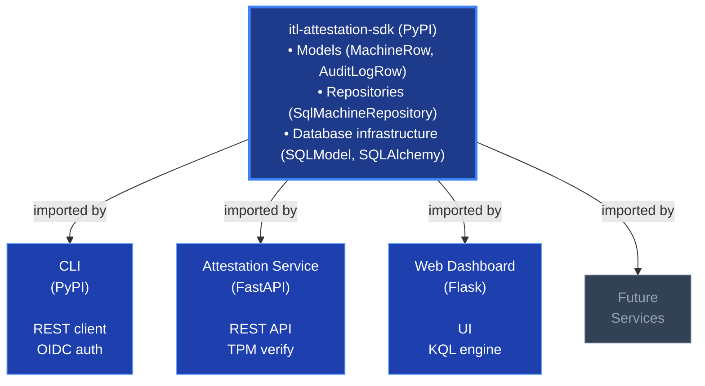

# ITL.ControlPlane.Attestation — Documentation

## Overview

The ITL Control Plane Attestation platform provides TPM-based hardware identity and attestation for Talos Kubernetes clusters. The platform is split into **four separate packages**:

### 1. SDK Package (`itl-attestation-sdk`)

Central data layer shared by all services. Published to PyPI.

- **Models**: MachineRow, AuditLogRow, ApprovalRequestRow
- **Repositories**: SqlMachineRepository, AuditRepository, ApprovalRequestRepository
- **Core**: Config, database, exceptions

**Installation**: `pip install itl-attestation-sdk`

### 2. CLI Package (`itl-attestation-cli`)

Command-line interface for operators. Communicates with the attestation API via REST.

- **Authentication**: Interactive browser (PKCE), password, device code flows
- **Token caching**: `~/.itl/attestation-cache/`
- **Commands**: `auth`, `machine`, `audit`
- **Output formats**: JSON, table

**Installation**: `pip install itl-attestation-cli`

**Quick start**:
```bash
attestation auth login
attestation machine list --status pending_approval
attestation machine approve <machine-id> --reason "Production deployment"
```

### 3. Attestation Service

FastAPI service implementing the attestation REST API. Uses SDK for data access.

- TPM verification and EK fingerprinting
- OIDC authentication via Keycloak
- Dual-control approval workflows
- Talos config generation and delivery
- Enrollment CA management
- Cryptographic audit log

### 4. Web Dashboard

Flask-based web interface for operators. Uses SDK for data access.

- Azure Portal dark theme
- Dashboard with compliance metrics
- Machine list/detail views with filtering
- Audit log with cryptographic verification
- KQL query engine for advanced filtering
- Pending approval management

---

## Documentation

| Document | Description |
|---|---|
| [ARCHITECTURE.md](ARCHITECTURE.md) | System architecture, source layout, data models, state machines |
| [DEPLOYMENT.md](DEPLOYMENT.md) | Deployment guide, Docker Compose, environment variables, CLI setup |
| [OPERATIONS.md](OPERATIONS.md) | Operator workflows, CLI and curl examples, monitoring, backup |
| [ENDPOINTS.md](ENDPOINTS.md) | REST API reference, request/response schemas |
| [SECURITY.md](SECURITY.md) | Security architecture, CNSA 1.0 compliance, threat model |
| [TPM_EXPLAINED.md](TPM_EXPLAINED.md) | TPM concepts, EK/AK hierarchy, attestation flows |
| [WALKTHROUGH.md](WALKTHROUGH.md) | Step-by-step walkthrough of the full registration and attestation flow |
| [EXTENSIONS.md](EXTENSIONS.md) | Extension system, Secret Vault, extension development guide |

---

## Quick Links

### For Operators

- [Install CLI](DEPLOYMENT.md#cli-installation)
- [Authentication Options](OPERATIONS.md#operator-authentication)
- [Approve Machines](OPERATIONS.md#0-zero-touch-registration-via-talos-extension-no-usb-agent)
- [Lock/Unlock Machines](OPERATIONS.md#3-lock-a-machine-temporarily)
- [Revoke with Wipe](OPERATIONS.md#5-revoke-a-machine-with-remote-wipe)
- [Audit Log](OPERATIONS.md#audit-log)
- [Secret Vault Extension](EXTENSIONS.md#secret-vault)
- [Webhooks Extension](EXTENSIONS.md#webhooks)
- [Metrics Extension](EXTENSIONS.md#metrics)

### For Developers

- [SDK Installation & Usage](ARCHITECTURE.md#1-sdk-package-srcsdk--itl-attestation-sdk)
- [CLI Package Structure](ARCHITECTURE.md#2-cli-package-srccli--itl-attestation-cli)
- [API Endpoints](ENDPOINTS.md)
- [Data Models](ARCHITECTURE.md#data-model)
- [Extension Development](EXTENSIONS.md#developing-extensions)

### For Administrators

- [Docker Compose Setup](DEPLOYMENT.md#docker-compose-recommended)
- [Environment Variables](DEPLOYMENT.md#environment-variables)
- [Production Checklist](DEPLOYMENT.md#production-checklist)
- [Backup & Recovery](OPERATIONS.md#backup-and-recovery)
- [Monitoring](OPERATIONS.md#monitoring)

---

## Package Relationships



---

## Support

- **Issues**: [GitHub Issues](https://github.com/ITLusions/ITL.ControlPlane.Attestation/issues)
- **Documentation**: [docs/](https://itlusions.github.io/ITL.ControlPlane.Attestation/)
- **Contact**: info@itlusions.com
