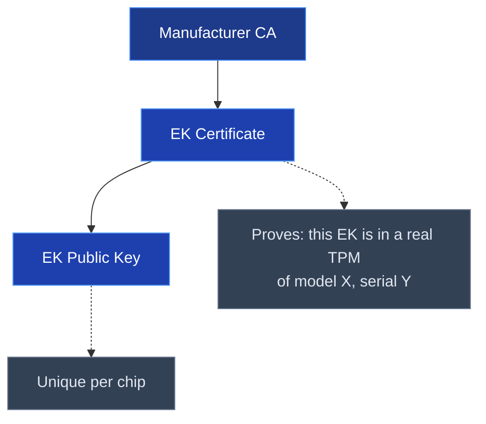
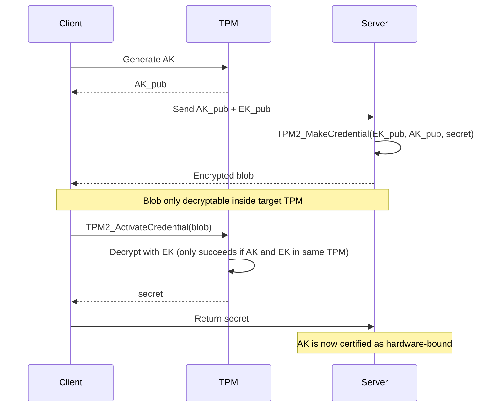
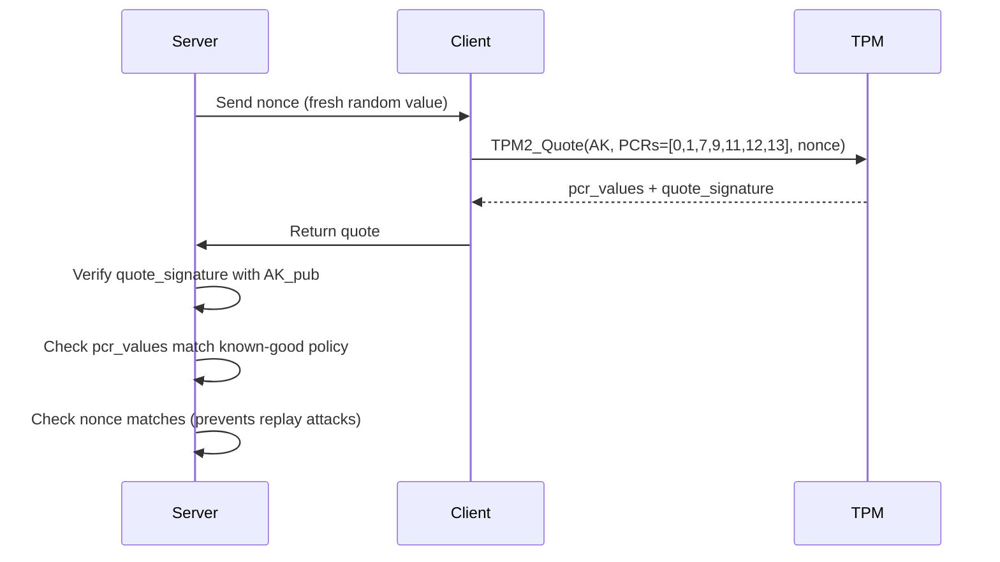

# How a TPM Works

## What is a TPM?

A **Trusted Platform Module (TPM)** is a dedicated security chip — either soldered to a motherboard (discrete TPM) or implemented in firmware (fTPM) — that provides a hardware root of trust for a machine. It cannot be removed, copied, or impersonated.

The TPM standard is defined by the **Trusted Computing Group (TCG)**. This document covers TPM 2.0.

---

## Core Concepts

### Keys live inside the TPM

All TPM private keys are generated and used inside the chip boundary. A private key **never leaves** the TPM as plaintext. If you ask the TPM to sign something, it returns the signature — not the key.

### Hierarchies

TPM 2.0 organises keys and objects into three hierarchies:

| Hierarchy | Purpose |
|---|---|
| **Endorsement (EH)** | Manufacturer-provisioned identity. The root of hardware identity. |
| **Storage (SH)** | User/OS objects — wrapping keys, sealing storage. |
| **Platform (PH)** | Firmware/BIOS use. Typically not accessible to the OS. |

---

## The Endorsement Key (EK)

The EK is the machine's permanent hardware identity.

- Generated by the manufacturer during production
- Stored in the Endorsement Hierarchy — cannot be deleted or overridden
- The **EK public key** can be read by anyone: `tpm2_readpublic -c 0x81010001`
- The **EK private key** never leaves the chip
- An **EK Certificate** (signed by the manufacturer's CA) proves the key is in a genuine TPM



The EK fingerprint (SHA-256 of the raw EK cert/pub bytes, or SHA-384 for CNSA 2.0 compliance) is used as a hardware identifier.

---

## Platform Configuration Registers (PCRs)

PCRs are fixed-size registers inside the TPM that record what software has run on a machine. With SHA-256 banks they are 32 bytes; with SHA-384 banks (CNSA 2.0) they are 48 bytes.

**Key property**: PCRs can only be *extended* — never directly written.

```
new_value = SHA-384(old_value || new_measurement)
```

This creates a tamper-evident chain: any change to a previously measured value changes all subsequent PCR values.

### Standard PCR assignments (UEFI/Linux)

| PCR | What is measured |
|---|---|
| 0 | UEFI firmware executable |
| 1 | UEFI firmware configuration |
| 2 | UEFI option ROMs |
| 3 | UEFI option ROM configuration |
| 7 | Secure Boot state + certificates |
| 9 | GRUB / bootloader |
| 11 | Linux kernel image |
| 12 | Kernel command line |
| 13 | initrd |
| 14 | Loaded modules |

A PCR value only matches a known-good policy if the machine booted exactly the expected software. Any modification — tampered firmware, injected kernel module, disabled Secure Boot — produces a different PCR value.

---

## Attestation Keys (AK)

An EK cannot be used for signing (by design — to protect privacy). Instead, an **Attestation Key (AK)** is used.

An AK is a signing key generated inside the TPM Storage Hierarchy. To prove an AK is hardware-resident in the same TPM as the EK, a **Credential Activation** ceremony is performed:



---

## TPM Quote — Attesting the Boot State

Once an AK is certified, the TPM can produce a **Quote**: a signed snapshot of current PCR values.



A valid Quote proves:
1. The AK signing the quote is in the same TPM as the registered EK
2. The machine booted exactly the expected firmware and kernel
3. The quote was produced right now (nonce prevents recording and replaying)

---

## TPM Sealing

The TPM can **seal** (encrypt) data to a specific PCR state. The data can only be unsealed if the machine is currently in the expected state.

```python
# Seal a disk encryption key to PCR state
tpm2_create --policy-pcr --pcr-list sha384:0,7,11 -i disk_key.bin -u sealed.pub -r sealed.priv

# Unseal only works if PCR 0, 7, 11 match the policy at seal time
tpm2_unseal -c sealed_handle -p pcr:sha384:0,7,11
```

Use case: automatic disk unlock only on known-good boot. Tampered firmware → PCR mismatch → unsealing fails → disk stays encrypted.

---

## Summary: What the TPM Guarantees

| Guarantee | Mechanism |
|---|---|
| Hardware identity | EK (manufacturer-signed, hardware-bound) |
| Boot integrity | PCR measurements (tamper-evident chain) |
| AK is in real hardware | Credential Activation ceremony |
| Quote is fresh | Server-issued nonce in TPM2_Quote |
| Payload only decryptable by target machine | Encrypt with EK_pub, decrypt via TPM2_RSA_Decrypt |
| Data only accessible in known-good state | PCR-policy sealing |

---

## Key TPM 2.0 Commands

| Command | Purpose |
|---|---|
| `tpm2_readpublic -c 0x81010001` | Read the EK public key |
| `tpm2_getekcertificate` | Read the manufacturer EK certificate |
| `tpm2_createak` | Generate an Attestation Key |
| `tpm2_makecredential` | Server-side: encrypt credential to EK |
| `tpm2_activatecredential` | Client-side: decrypt credential using TPM |
| `tpm2_quote` | Produce a signed PCR snapshot |
| `tpm2_pcrread` | Read current PCR values |
| `tpm2_create --policy-pcr` | Create a PCR-policy sealed object |
| `tpm2_unseal` | Unseal a PCR-policy object |

---

## How This Service Uses the TPM

```mermaid
flowchart TD
    A[Machine boots] --> B[TPM measures each boot stage into PCRs]
    B --> C[itl-tpm-register reads EK public key + EK certificate]
    C --> D[POST /api/v1/register]
    D --> E[Server records EK fingerprint]
    
    E --> F[AK Credential Activation<br/>one-time]
    F --> G[Proves AK is hardware-resident<br/>in this specific TPM]
    
    G --> H[Attestation<br/>periodic or on-demand]
    H --> I[GET /api/v1/attest/challenge]
    I --> J[Server issues nonce]
    J --> K[tpm2_quote over PCRs with nonce]
    K --> L[POST /api/v1/attest]
    L --> M[Server verifies quote + PCR policy]
    M --> N[Machine state: registered → attested]
    N --> O[Server delivers encrypted MachineConfig<br/>wrapped to EK]
    
    style A fill:#1e3a8a,stroke:#3b82f6,color:#fff
    style B fill:#065f46,stroke:#10b981,color:#fff
    style C fill:#7c2d12,stroke:#f97316,color:#fff
    style D fill:#1e40af,stroke:#60a5fa,color:#fff
    style E fill:#1e40af,stroke:#60a5fa,color:#fff
    style F fill:#7c2d12,stroke:#f97316,color:#fff
    style G fill:#065f46,stroke:#10b981,color:#fff
    style H fill:#7c2d12,stroke:#f97316,color:#fff
    style I fill:#1e40af,stroke:#60a5fa,color:#fff
    style J fill:#1e40af,stroke:#60a5fa,color:#fff
    style K fill:#7c2d12,stroke:#f97316,color:#fff
    style L fill:#1e40af,stroke:#60a5fa,color:#fff
    style M fill:#1e40af,stroke:#60a5fa,color:#fff
    style N fill:#065f46,stroke:#10b981,color:#fff
    style O fill:#065f46,stroke:#10b981,color:#fff
```



---

## Further Reading

- [TCG TPM 2.0 Library Specification](https://trustedcomputinggroup.org/resource/tpm-library-specification/)
- [TCG EK Credential Profile v2.4](https://trustedcomputinggroup.org/resource/http-trustedcomputinggroup-org-wp-content-uploads-tcg-ek-credential-profile/)
- [TCG Remote Attestation Procedures](https://trustedcomputinggroup.org/resource/tcg-rats-architecture/)
- [NIST SP 800-193 — Platform Firmware Resiliency Guidelines](https://csrc.nist.gov/publications/detail/sp/800-193/final)
- [tpm2-tools documentation](https://github.com/tpm2-software/tpm2-tools)
