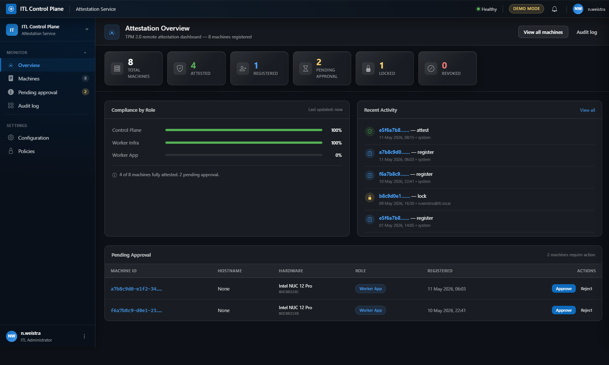
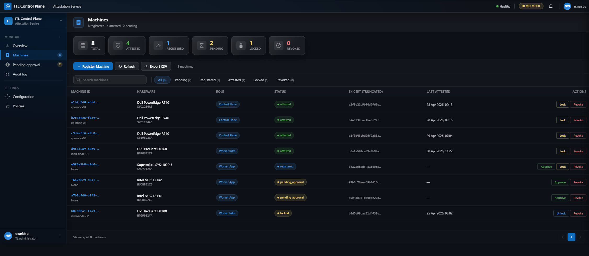
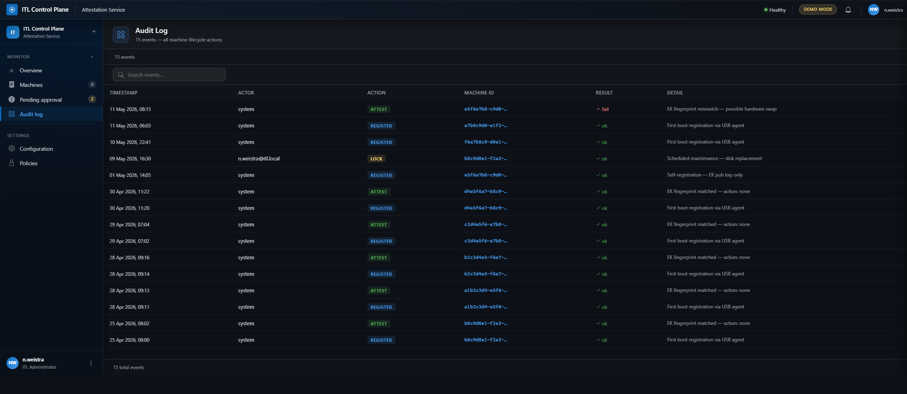
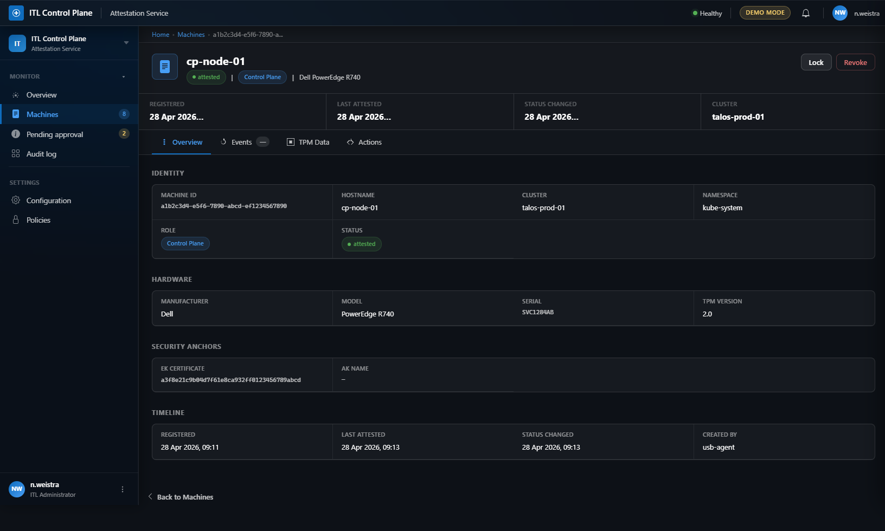
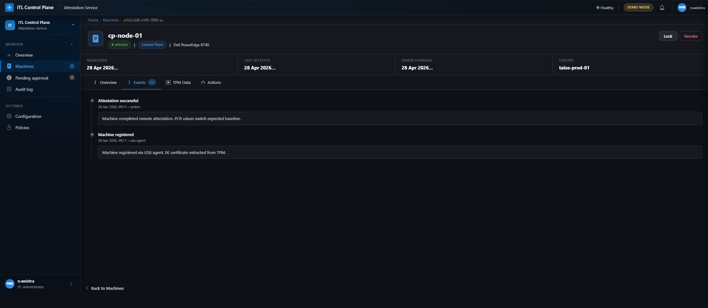
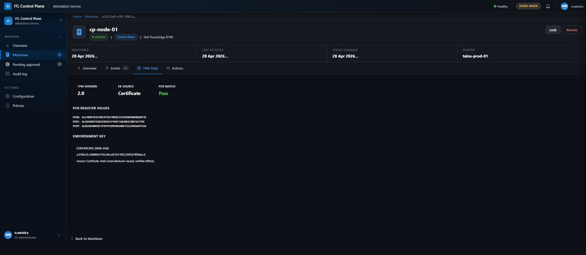
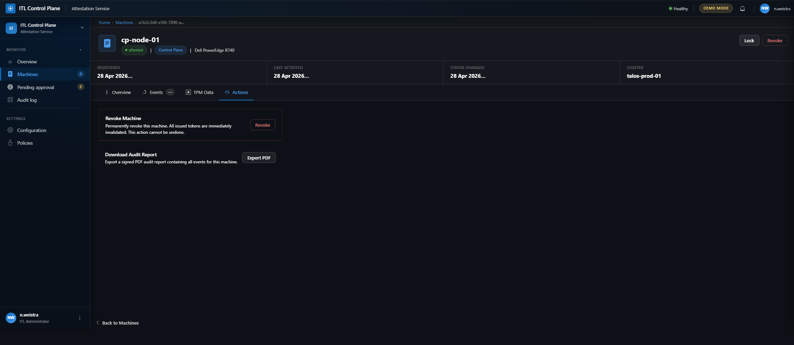
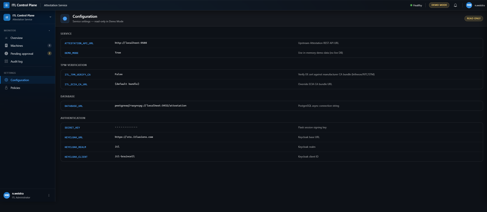
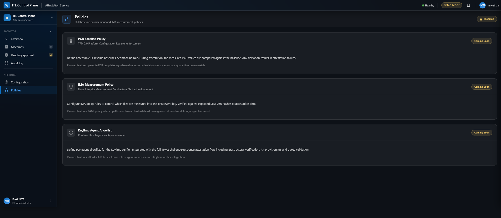

# ITL Attestation — UI Walkthrough

Visual walkthrough of the live Flask web dashboard. All screenshots use the Azure Portal dark theme design system with Bootstrap 5 components.

**Run the app**: `cd src/web && flask --app app run --port 7788`

---

## 1. Dashboard overview

**Route**: `/` (dashboard.dashboard)

Six stat tiles showing total machines, attested count, registered count, pending approvals, locked count, and revoked count.

**Compliance by Role** — Progress bars for each role showing attestation compliance:
- Control Plane (100%)
- Worker Infra (100%)
- Worker App (0%)

Color-coded: green for 100%, yellow for ≥50%, gray otherwise. Info banner showing attested/total/pending counts.

**Recent Activity** — Timeline feed with colored circular icons per action type:
- **Register** (blue clipboard icon)
- **Attest** (green shield icon)
- **Lock** (yellow lock icon)
- **Revoke** (red X icon)

Each entry shows truncated machine ID (linked), action label, timestamp, and actor.

**Pending Approval** — Data table (conditional, only shows if pending machines exist) with columns:
- Machine ID (linked to detail page)
- Hostname
- Hardware (model + serial)
- Role badge
- Registered timestamp
- Actions: inline Approve (blue) and Reject (gray) buttons with confirmation dialogs

---

## 2. Machines list

**Route**: `/machines` (machines.machines_list)

Full machine inventory with command bar (refresh, export CSV, add machine). Filter chips for status (All / Pending / Attested / Locked / Revoked / Rejected). Data table with machine ID, hostname, role badge, and status badge. Clicking a row navigates to machine detail page.

---

## 3. Audit log

**Route**: `/audit` (audit.audit_log)

Comprehensive audit trail showing timestamp, machine ID (linked), action badge (REGISTER / ATTEST / APPROVE / LOCK / REVOKE), and result status. All events are timestamped and linked to their source machine for full traceability.

---

## 4. Machine detail

**Route**: `/machines/<machine_id>` (machines.machine_detail)

Breadcrumb navigation (Home › Machines › Machine ID). Hero header with machine icon, name (cp-node-01), inline badges (status, role, hardware), and action buttons (Lock, Revoke). Stats row showing Registered, Last Attested, Status Changed, and Cluster.

### Tabs

**Overview** — Four description list sections:
- **Identity**: Machine ID, hostname, cluster, namespace, role, status
- **Hardware**: Manufacturer, model, serial, TPM version
- **Security Anchors**: EK certificate hash, AK name
- **Timeline**: Registered, last attested, status changed, created by, notes

**Events** — Timeline feed showing machine lifecycle events (registration, attestation, approval, status changes) with timestamps, actors, and detailed event descriptions.

**TPM Data** — Three stat cards (TPM Version, EK Source, PCR Match status). PCR register values (PCR0, PCR1, PCR7) in monospace font. Endorsement Key certificate hash with source verification note.

**Actions** — Contextual action cards based on machine state:
- **Unlock Machine** (only if locked) — Re-enable attestation
- **Revoke Machine** — Permanently invalidate machine credentials (destructive action)
- **Download Audit Report** — Export signed PDF with all events for this machine

---

## 5. Configuration

**Route**: `/configuration` (configuration.configuration)

Read-only configuration viewer showing all service settings grouped by category:
- **Service**: Attestation API URL, demo mode flag
- **TPM Verification**: CA verification toggle, ECIA CA bundle URL
- **Database**: PostgreSQL async connection string
- **Authentication**: Secret key (masked), Keycloak URL/realm/client

All settings display key, value (with masking for secrets), and description. Read-only badge indicates demo mode.

---

## 6. Policies

**Route**: `/policies` (policies.policies)

Policy roadmap page showing three planned enforcement features:
- **PCR Baseline Policy**: TPM 2.0 Platform Configuration Register enforcement with per-role templates and deviation alerts
- **IMA Measurement Policy**: Linux Integrity Measurement Architecture file hash verification with YAML policy editor
- **Keylime Agent Allowlist**: Runtime integrity via Keylime verifier with TPM2 challenge-response flow

Each card shows "Coming Soon" badge and lists planned features.

---

## Routes

| Page | Route | Blueprint.Function | Purpose |
|---|---|---|---|
| Dashboard | `/` | dashboard.dashboard | Stats, compliance, quick actions |
| Machines | `/machines` | machines.machines_list | Full inventory with filters |
| Audit log | `/audit` | audit.audit_log | Event timeline with traceability |
| Machine detail | `/machines/<id>` | machines.machine_detail | Single machine overview |
| Configuration | `/configuration` | configuration.configuration | Service settings (read-only) |
| Policies | `/policies` | policies.policies | Policy roadmap |
