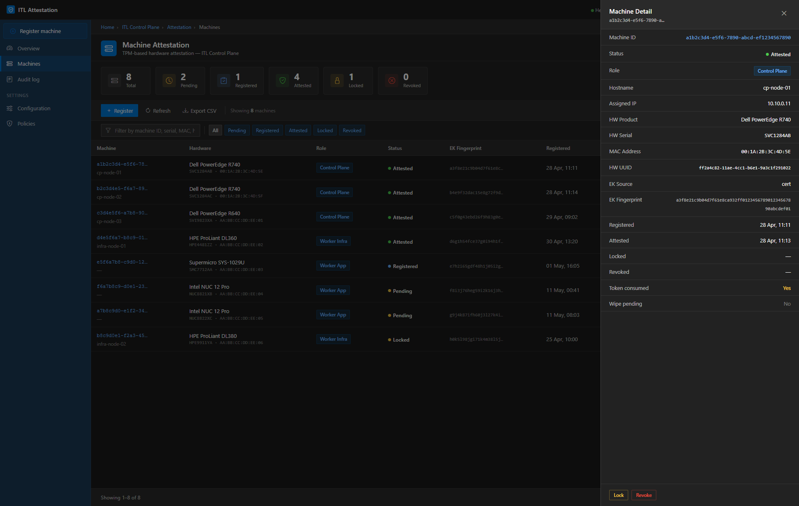
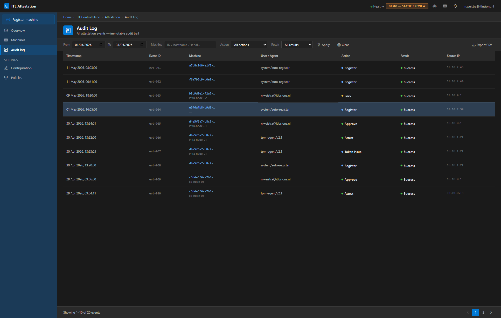
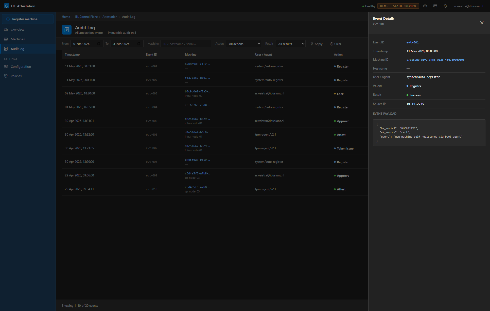
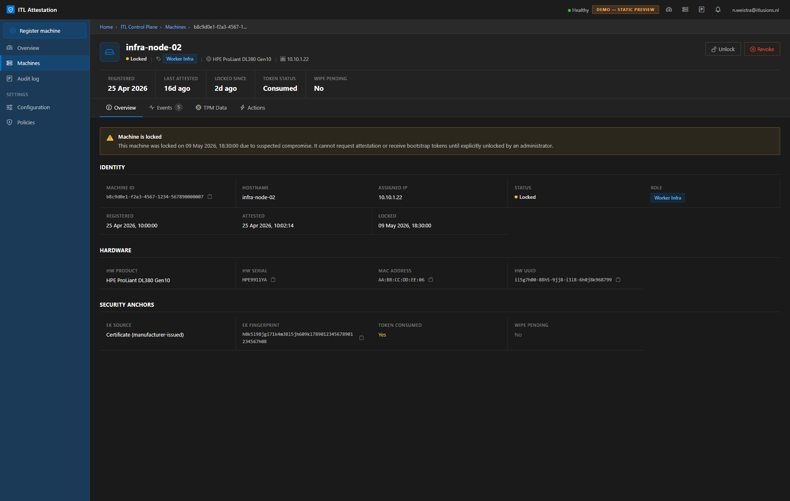
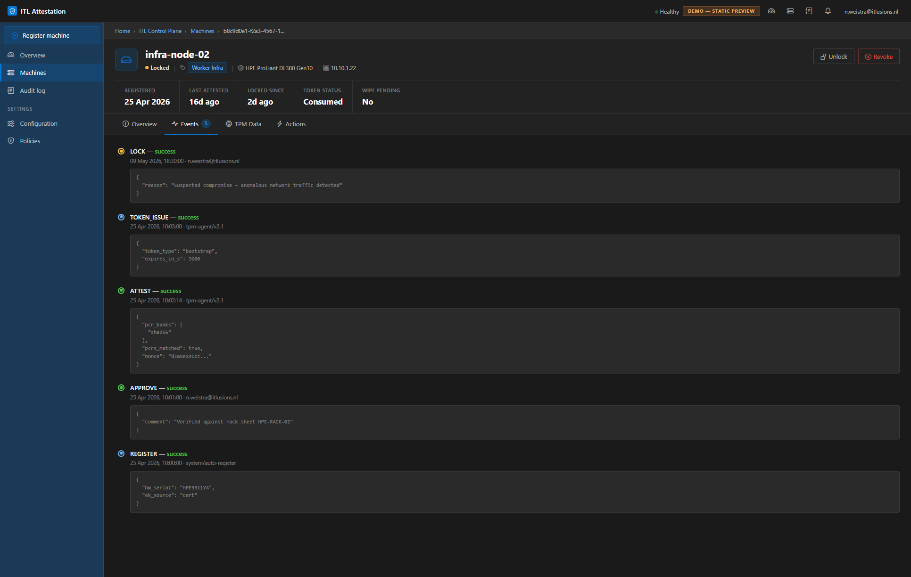
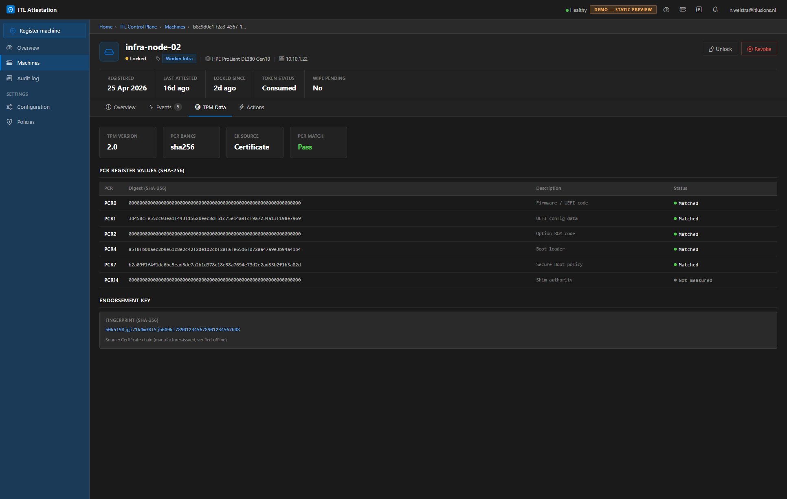
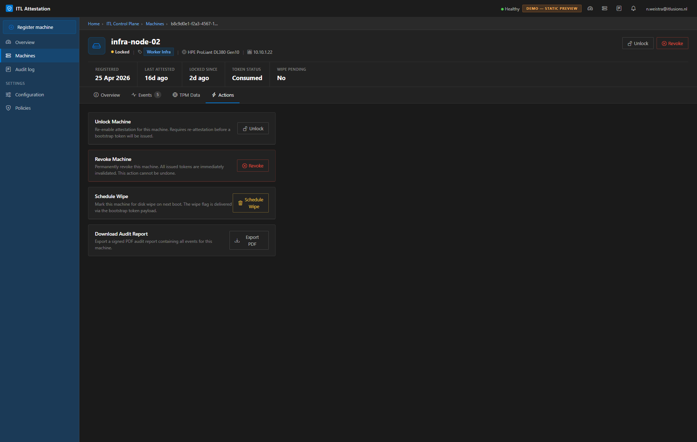
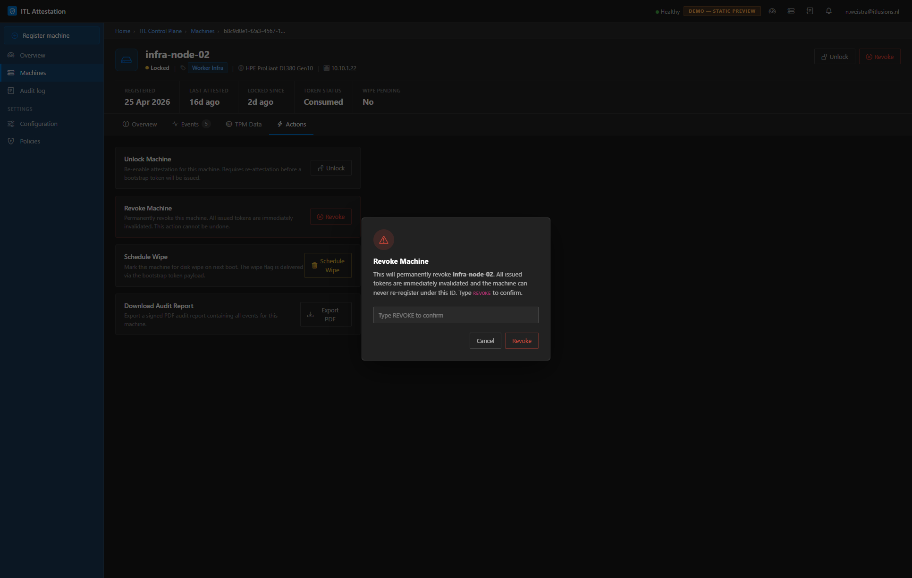

# ITL Attestation — UI Walkthrough

Visual walkthrough of all demo pages. All screenshots use the Azure Portal dark theme design system.

---

## 1. Dashboard overview

Stats tiles, compliance progress bars per role, recent activity feed, and the pending approvals table.

---

## 2. Machine list

Full machine inventory with filter chips (All / Pending / Attested / Locked), status badges, and action buttons.

---

## 3. Machine list — detail panel

Clicking a row opens a slide-in context panel with machine metadata, status, and quick actions — without leaving the list view.

---

## 4. Audit log

20 synthetic audit events with date range, machine, action, and result filters. Paginated table, 10 per page.

---

## 5. Audit log — event detail panel

Clicking an event row opens a panel with full event metadata and a JSON payload viewer.

---

## 6. Machine detail — Overview tab

Hero header with stat bar (registered date, last attested, locked since, token status). Description list with copy-to-clipboard fields.

---

## 7. Machine detail — Events tab

Timeline feed of all attestation events for this machine with action badges and timestamps.

---

## 8. Machine detail — TPM Data tab

PCR register table with index, algorithm, value, and description columns. Locked-state alert banner.

---

## 9. Machine detail — Actions tab

Available administrative actions: Unlock, Revoke attestation, Schedule wipe. Each card shows consequences before confirmation.

---

## 10. Machine detail — Revoke confirmation modal

Destructive actions require typed confirmation (`infra-node-02`) before the button becomes active, preventing accidental revocations.

---

## Pages

| Page | URL | Purpose |
|---|---|---|
| Dashboard | `demo-dashboard.html` | Stats, compliance, pending approvals |
| Machines | `demo.html` | Full machine list with filter and detail panel |
| Audit log | `demo-audit.html` | Audit events with filters and event panel |
| Machine detail | `demo-machine.html` | Single machine: Overview / Events / TPM Data / Actions |
