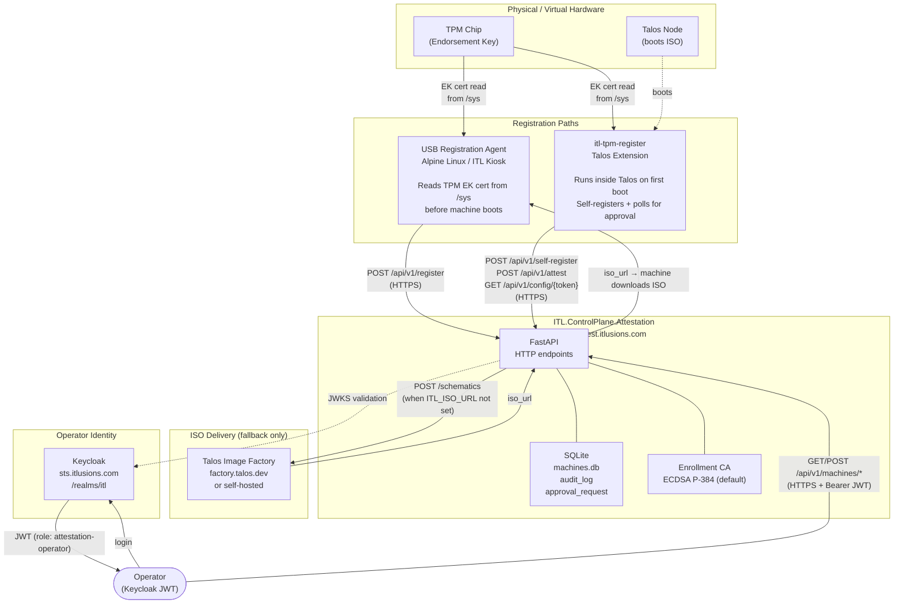
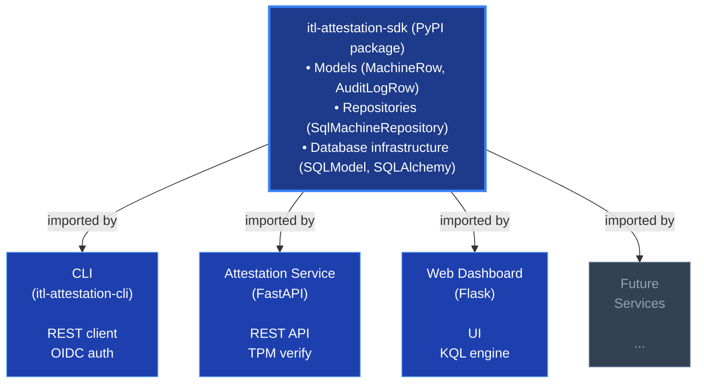
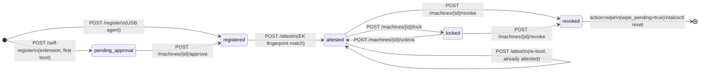
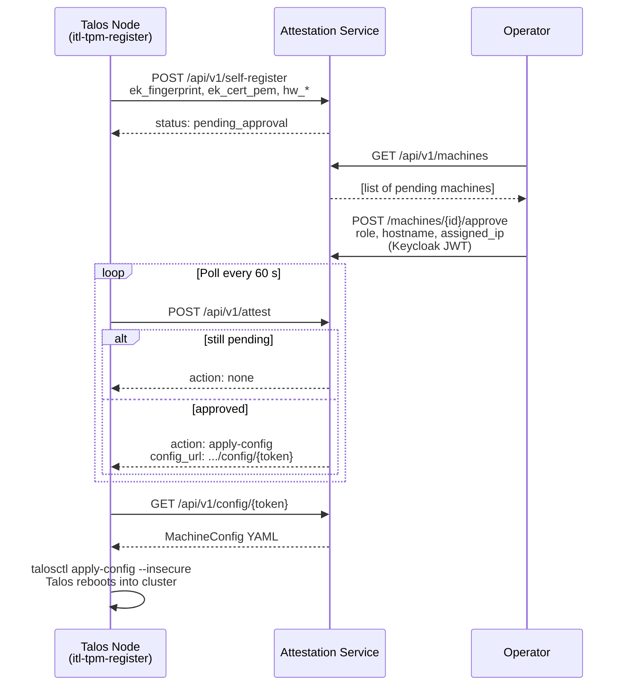
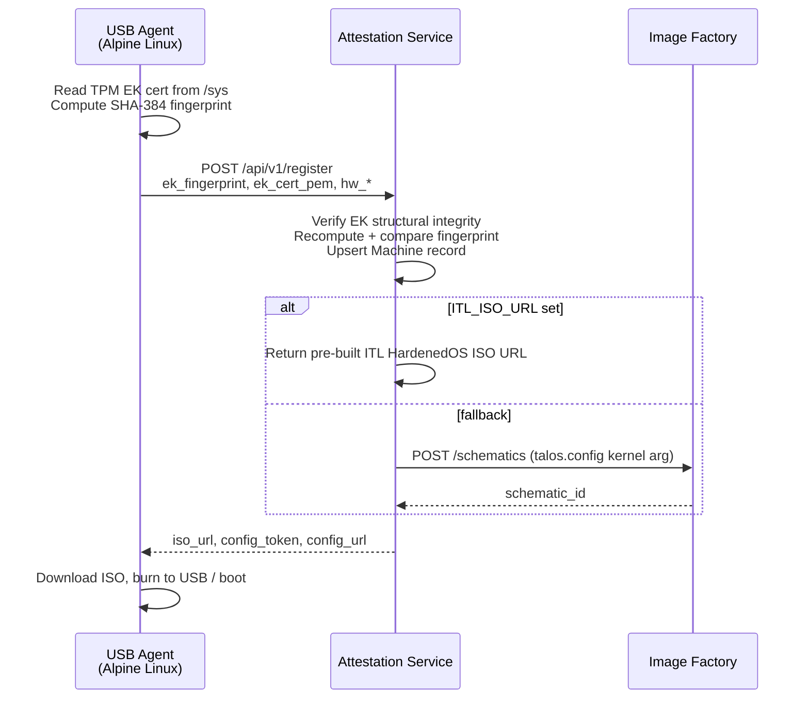
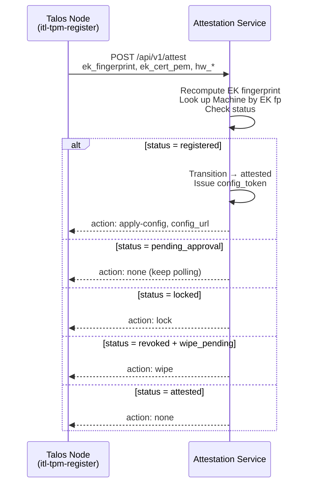
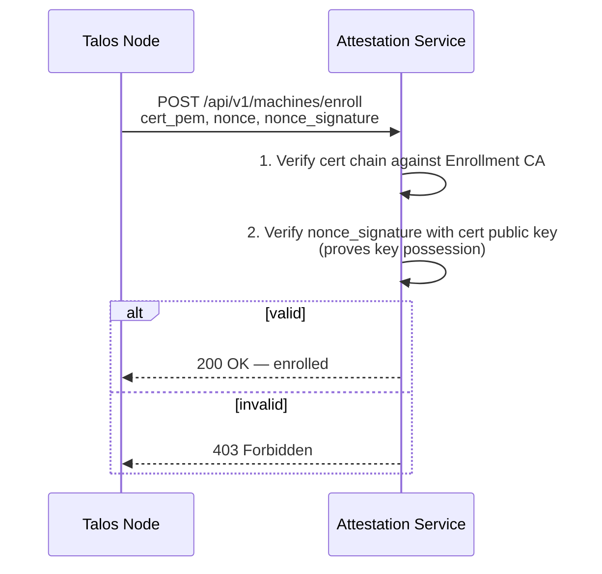

# Architecture — ITL.ControlPlane.Attestation

## Purpose

The Attestation Service is the hardware trust broker for the ITL Control Plane. It answers a single core question for every node that boots:

> "Is this the physical machine we expect, and is it authorised to join the cluster?"

It does this by anchoring machine identity to the TPM Endorsement Key (EK) — a hardware-bound asymmetric key that cannot be migrated or cloned. Machines register before deployment, boot a signed Talos ISO, and are admitted (or rejected) by an operator before receiving cluster credentials.

---

## System Context



---

## Source Layout

The platform is split into **three separate packages**:

### 1. **SDK Package** (`src/sdk/` → `itl-attestation-sdk`)

Central data layer shared by all services. Published as a standalone PyPI package.

```
src/sdk/
  core/
    config.py           — AttestationConfig (Pydantic BaseSettings) + config singleton
    database.py         — Async SQLAlchemy engine + session factory + init_db()
    exceptions.py       — Exception hierarchy (MachineNotFoundError, etc.)
  models/
    machine.py          — MachineRow SQLModel table + NodeRole / MachineStatus enums
    operator.py         — AuditLogRow (append-only audit log with cryptographic chain) + ApprovalRequestRow
  repositories/
    machine_repo.py     — SqlMachineRepository: CRUD operations over MachineRow
    operator_repo.py    — AuditRepository (INSERT-only + chain verification) + ApprovalRequestRepository
  __init__.py           — Public exports: config, models, repositories, exceptions
  pyproject.toml        — Package metadata (hatchling, dependencies, dev extras)
  README.md             — SDK usage documentation
```

**Installation**: `pip install itl-attestation-sdk`

**Usage**:
```python
from sdk.core import config
from sdk.models import MachineRow, MachineStatus
from sdk.repositories import SqlMachineRepository
```

### 2. **CLI Package** (`src/cli/` → `itl-attestation-cli`)

Command-line interface for operators. Communicates with the attestation API via REST. Published as a standalone PyPI package.

```
src/cli/
  keycloak_client.py    — OIDC authentication: interactive (PKCE), password, device code flows
  token_cache.py        — File-based token cache (~/.itl/attestation-cache/)
  api_client.py         — REST API client with Bearer token authentication
  __main__.py           — Click CLI entry point with command groups:
                           • attestation auth (login, logout, whoami, cache-list, clear-cache)
                           • attestation machine (list, get, approve, lock, unlock, revoke)
                           • attestation audit (list, verify)
  __init__.py           — Public exports: KeycloakClient, OIDCToken, TokenCache, AttestationClient
  pyproject.toml        — Package metadata (hatchling, dependencies: click, httpx)
  README.md             — CLI usage documentation
```

**Installation**: `pip install itl-attestation-cli`

**Usage**:
```bash
attestation auth login
attestation machine list --status pending_approval
attestation machine approve <machine-id> --reason "Production deployment"
attestation audit verify
```

### 3. **Attestation Service** (`src/attestation/`)

FastAPI service implementing the attestation REST API. Uses SDK for data access. Deployed as Docker container.

```
src/attestation/
  core/
    deps.py             — FastAPI dependency injectors: get_db(), get_engine(), resolve_operator()
    app.py              — create_app() factory + lifespan (DB init, CA init)
  schemas/
    requests.py         — Pydantic request schemas (RegisterRequest, AttestRequest, etc.)
    responses.py        — Pydantic response schemas (AttestResponse, MachineDetail, etc.)
  pki/
    enrollment_ca.py    — Enrollment CA: cert issuance, chain verification, RSA-OAEP wrapping
    tpm_verifier.py     — EK material verification + SHA-256/SHA-384 fingerprint computation
    quote_verifier.py   — TPM2_Quote signature + TPMS_ATTEST parsing + PCR digest verification
    nonce_store.py      — In-memory nonce store with 60-second TTL
    oidc.py             — Keycloak OIDC JWT validation: JWKS fetch, signature verify, role check
  core/
    events.py           — NodeEvent enum (9 lifecycle events) + NodeEventPayload dataclass
    eventbus.py         — EventBus class with async fan-out, 10 s per-handler timeout + bus singleton
  hooks.py              — Typed context dataclasses + named hook decorators (@on_registered, @on_online, etc.)
  handlers/
    registration.py     — Business logic for /register and /self-register; emits NODE_REGISTERED
    attestation.py      — Business logic for /attest; emits NODE_ONLINE on successful attestation
    config_delivery.py  — Business logic for /config/{token} and /config?mac=
    machines.py         — Business logic for machine CRUD, approve, revoke, lock, unlock; emits NODE_PROVISIONED, NODE_DECOMMISSIONED
    enrollment.py       — Business logic for /machines/enroll and /machines/{id}/request-cert
  routes/
    registration.py     — FastAPI router: POST /api/v1/register, /self-register
    attestation.py      — FastAPI router: GET /api/v1/attest/challenge, POST /api/v1/attest
    config.py           — FastAPI router: GET /api/v1/config, /api/v1/config/{token}
    machines.py         — FastAPI router: GET/POST /api/v1/machines/**
    audit.py            — FastAPI router: GET /api/v1/audit, /api/v1/audit/verify
  talos/
    config_generator.py — Merge role base configs with machine-specific overrides
    iso_factory.py      — Build Talos Image Factory schematic URLs
  main.py               — Entry point: app = create_app()
  core/app.py           — create_app() factory: registers GET /healthz and GET /api/v1/extensions directly
```

### 4. **Web Dashboard** (`src/web/`)

Flask-based web interface. Uses SDK for data access. Provides:
- Dashboard with machine overview and compliance metrics
- Machine list/detail views with filtering
- Audit log with cryptographic verification
- Pending approval management
- KQL query engine for advanced filtering

```
src/web/
  api/
    dashboard.py        — Dashboard route handler
    machines.py         — Machine routes
    audit.py            — Audit log routes
  core/
    deps.py             — Flask request-scoped DB session management
    adapters.py         — SQLModel → dict conversion for Jinja2 templates
  services/
    kql_engine.py       — Kusto Query Language parser for machine queries
  templates/            — Jinja2 templates with Azure Portal dark theme
  static/               — CSS, JavaScript, assets
  app.py                — Flask application factory
```

### Package Relationships



All services share the same data models and repositories via the SDK, ensuring consistency across the platform.

---

## Extension System

The attestation platform supports a modular extension system for adding functionality without modifying the core service.

### Architecture

Extensions implement the `AttestationExtension` ABC and are discovered automatically at startup. They can contribute REST routes, database models, lifecycle hooks, and **node event handlers** that subscribe to machine lifecycle events via the `EventBus`.

```
src/attestation/
├── core/
│   ├── events.py        # NodeEvent enum + NodeEventPayload dataclass
│   └── eventbus.py      # EventBus (async fan-out, 10 s timeout isolation) + bus singleton
├── hooks.py             # Typed context objects + named decorators (@on_registered, @on_online, …)
src/extensions/
├── __init__.py          # Discovery and registry
├── base.py              # AttestationExtension ABC (re-exports from SDK)
└── builtin/
    ├── secret_vault/    # TPM-bound + shared secret storage (v2.0.0)
    │   ├── extension.py
    │   ├── base_crypto.py       # BaseCrypto ABC
    │   ├── base_models.py       # EncryptedSecretMixin
    │   ├── crypto.py            # MachineSecretCrypto
    │   ├── shared_crypto.py     # SharedSecretCrypto
    │   ├── models.py            # SecretRow
    │   ├── shared_models.py     # SharedSecretRow
    │   ├── schemas.py
    │   ├── shared_schemas.py
    │   ├── repository.py
    │   └── shared_repository.py
    ├── webhooks/        # HTTP webhook delivery for events
    │   ├── extension.py
    │   ├── models.py
    │   ├── schemas.py
    │   ├── repository.py
    │   └── deliverer.py
    └── metrics/         # Prometheus metrics exporter
        └── extension.py
```

### Extension Contract

Each extension must implement:

- `name` — Unique identifier (snake_case)
- `version` — Semantic version string
- `description` — Human-readable description
- `get_router()` — FastAPI router for REST endpoints (or None)
- `get_models()` — SQLModel classes for database (or empty list)
- `on_startup()` — Lifecycle hook (optional)
- `on_shutdown()` — Lifecycle hook (optional)

Extensions can also **subscribe to node lifecycle events** by applying the named hook decorators from `attestation.hooks` at module level:

```python
from attestation.hooks import on_registered, on_online, on_decommissioned

@on_registered
async def handle_registration(ctx: RegisteredContext) -> None: ...

@on_online
async def node_went_online(ctx: OnlineContext) -> None: ...
```

See [extension-development.md](../advanced/extension-development.md) for the full event API reference.

### Discovery Process

1. Service startup calls `discover_extensions()`
2. Built-in extensions loaded from `extensions.builtin.*`
3. External extensions loaded via `entry_points(group="attestation_extensions")`
4. Each extension's router registered in FastAPI app
5. Each extension's models registered for Alembic migrations
6. Startup hooks called
7. Node event handlers registered with `bus` at module import time (step 2/3 above) — no extra wiring needed

### Built-in Extensions

#### Secret Vault (`secret_vault`) v2.0.0

TPM-bound secret storage + shared secrets for attested machines.

**Features**:
- **Machine secrets**: Encrypted with machine-specific keys derived from EK fingerprint (HKDF-SHA256)
- **Shared secrets**: Multi-machine access with explicit ACL, encrypted with master key
- AES-256-GCM encryption with pluggable key derivation (BaseCrypto ABC)
- Base classes eliminate duplication (EncryptedSecretMixin for common fields)
- Access tracking and audit logging

**Endpoints**:
- Machine secrets: `POST/GET/DELETE /api/v1/secrets/machines/{id}/secrets`
- Shared secrets: `POST/GET/PUT/DELETE /api/v1/shared-secrets` + ACL management

**CLI**:
```bash
# Machine secrets
attestation secret create <machine-id> --name disk-key --value <secret>
attestation secret list <machine-id>

# Shared secrets
attestation shared-secret create prod-k8s-join-token --value "K07::..."
attestation shared-secret grant prod-k8s-join-token --machines <uuid1>,<uuid2>
```

**Database**: `extension_secrets`, `extension_shared_secrets`, `extension_shared_secret_access` tables.

#### Webhooks (`webhooks`) v1.0.0

HTTP webhook delivery for attestation events.

**Features**:
- Subscribe to event types (machine.registered, machine.approved, secret.accessed, etc.)
- HMAC-SHA256 signatures for verification
- Delivery history and audit log
- Automatic retry on failure

**Endpoints**: `POST/GET/PUT/DELETE /api/v1/webhooks`, delivery history, test endpoint

**CLI**:
```bash
attestation webhook add --url https://example.com/hooks --events machine.approved
attestation webhook list
```

**Database**: `extension_webhooks`, `extension_webhook_deliveries` tables.

#### Metrics (`metrics`) v1.0.0

Prometheus-compatible metrics exporter at `/metrics`.

**Features**:
- Machine registration/attestation counters
- Secret vault operation tracking
- Webhook delivery statistics
- Audit log activity counters
- Machine status gauges

**Endpoint**: `GET /metrics` (no auth, Prometheus scrape target)

**Database**: None (in-memory metrics).

See [EXTENSIONS.md](EXTENSIONS.md) for full documentation and extension development guide.

---

## Data Model

### Machine record (`machines` table)

| Field | Type | Description |
|---|---|---|
| `machine_id` | UUID v4 | Stable logical identifier assigned at registration |
| `ek_fingerprint` | SHA-384 hex (96 chars) | Primary hardware identity — SHA-384 of raw EK cert/pub bytes (CNSA 1.0, FIPS 180-4) |
| `ek_fingerprint_sha384` | SHA-384 hex (96 chars, nullable) | Populated by the migration script for pre-existing rows; equals `ek_fingerprint` for new registrations |
| `ek_source` | `cert` \| `pub` | Which TPM EK material was presented |
| `ek_cert_pem` | base64-encoded PEM (nullable) | Raw EK certificate — stored for EK-bound config encryption; populated on first register/attest |
| `hw_uuid`, `hw_mac`, `hw_serial`, `hw_product` | string | SMBIOS hardware identity fields (secondary; EK fp is canonical) |
| `role` | `controlplane` \| `worker-infra` \| `worker-app` \| `generic` \| `windows` \| `linux` | Assigned node role |
| `status` | enum (see below) | Current lifecycle state |
| `hostname`, `assigned_ip` | optional string | Set by operator at approval |
| `config_token` | random URL-safe token | One-time token for Talos config fetch |
| `token_consumed` | bool | True after first successful config fetch |
| `wipe_pending` | bool | When True + status=revoked, next attest triggers talosctl reset |
| `ak_pub` | SubjectPublicKeyInfo PEM (nullable) | AK public key registered via `POST /machines/{id}/ak-activate`; null until AK is activated |

### Audit log (`audit_log` table)

Append-only — no UPDATE or DELETE is ever issued against this table. Every admin action writes one row.

Each row includes two cryptographic fields that form a **tamper-evident hash chain**:
- `prev_hash` — SHA-256 of the previous entry's canonical form (`"0"×64` for the genesis entry).
- `entry_hash` — SHA-256 of this entry's canonical form (all content fields including `prev_hash`, excluding `id` and `entry_hash` itself).

Any modification to a historical entry invalidates all subsequent hashes, detectable via `GET /api/v1/audit/verify`.

| Field | Type | Description |
|---|---|---|
| `id` | integer PK | Auto-increment |
| `timestamp` | datetime (UTC) | When the action occurred |
| `operator_cn` | string | Keycloak `preferred_username`, mTLS cert `CN`, or `"SYSTEM"` (break-glass) |
| `action` | string | `approve`, `approve_vote`, `revoke`, `lock`, `unlock`, `offline_bundle`, `import` |
| `machine_id` | optional string | Machine affected (null for service-level events) |
| `prev_state` | optional string | Machine status before the action |
| `new_state` | optional string | Machine status after the action (null for vote-only events) |
| `detail` | optional string | Free-text note / reason supplied by operator |
| `prev_hash` | string (SHA-256 hex) | SHA-256 of the previous row's canonical form; `"0"×64` for the first entry |
| `entry_hash` | string (SHA-256 hex) | SHA-256 of this row's canonical form (excluding `id` and `entry_hash`) |

### Approval requests (`approval_request` table)

Stores pending dual-control approval votes. The second operator's `approve` call checks for an active (non-expired, non-consumed) row from a **different** operator.

| Field | Type | Description |
|---|---|---|
| `id` | integer PK | Auto-increment |
| `machine_id` | string (indexed) | Machine being approved |
| `operator_cn` | string | First operator's identity |
| `role` | string | Role requested in the first vote |
| `hostname`, `assigned_ip` | optional string | Approval parameters from the first vote |
| `created_at` | datetime (UTC) | When the vote was cast |
| `expires_at` | datetime (UTC) | After this time the vote is ignored |
| `consumed` | bool | Set to `true` once the second approval completes |

### Machine status state machine



When `status=revoked` and `wipe_pending=True`, the next `POST /attest` response includes `"action": "wipe"`. The `itl-tpm-register` Talos extension calls `talosctl reset --graceful=false` on receipt, wiping STATE + EPHEMERAL before rebooting to maintenance mode.

---

## Extension Self-Registration Flow (No USB Agent)

When a machine boots a generic Talos ISO with `talos.config=https://attest.itlusions.com/api/v1/config` baked in, the `itl-tpm-register` extension can self-register without any USB agent pre-step.



The `action` field in `AttestResponse`:

| `action` | Meaning |
|---|---|
| `"none"` | Still pending or already attested — no action needed |
| `"apply-config"` | Machine just attested; fetch `config_url` and apply with `talosctl apply-config --insecure` |
| `"wipe"` | Machine revoked with `wipe_pending=true`; extension calls `talosctl reset --graceful=false` |
| `"lock"` | Machine temporarily locked; extension halts and logs |

---

## Registration Flow (USB Agent)



---

## Attestation Flow (First Talos Boot)



---

## Config Delivery

### Token-based (pre-registered machines)

The registration response includes a `config_url`:
```
https://attest.itlusions.com/api/v1/config/<token>
```

This URL is baked into the Talos ISO schematic via the Talos Image Factory kernel argument `talos.config=<url>`. Talos fetches it on first boot. The token is consumed after the first successful fetch (but re-fetchable on reboot).

### MAC-based (generic ISO / unknown machines)

A single generic Talos ISO can be deployed with:
```
talos.config=https://attest.itlusions.com/api/v1/config
```

Talos appends `?mac=<hw_mac>` automatically. The service looks up the MAC, returns the full machineconfig for attested machines, or a safe pending config (no cluster secrets) for all others.

---

## MachineConfig Generation

Role base configs (`controlplane-final.yaml`, `worker-infra-final.yaml`, `worker-app-final.yaml`) are pre-generated by the ITL.Talos.HardenedOS CI pipeline and stored at `ITL_CONFIG_CACHE_DIR` (default: `/var/lib/itl-reg/configs`).

The service merges machine-specific overrides on top:

| Override | Source |
|---|---|
| `machine.network.hostname` | Set by operator at approval |
| `machine.network.interfaces[0].addresses` | `assigned_ip` at approval |
| `machine.nodeLabels["itl.io/machine-id"]` | `machine_id` |
| `machine.nodeLabels["itl.io/tpm-ek"]` | First 16 chars of EK fingerprint |
| `machine.nodeAnnotations["itl.io/tpm-ek-full"]` | Full EK fingerprint |
| `machine.files` | Enrollment cert + key (offline bundles only) |

---

## Enrollment PKI

### CA

A self-signed RSA-4096 CA is auto-generated on first startup and persisted at `ITL_ENROLLMENT_CA_DIR` (default: `/var/lib/itl-reg/ca/`). It is valid for 10 years.

### Enrollment Certificates

Short-lived RSA-2048 certs are issued to machines that request them. The cert encodes:

| Field | Value |
|---|---|
| `CN` | `machine_id` |
| `OU` | `role` |
| `Key Usage` | `digitalSignature`, `keyEncipherment` |
| `EKU` | `clientAuth` |
| `URI SAN` | `urn:itl:ek:<ek_fingerprint>` |

The URI SAN binds the cert to the specific TPM hardware identity.

### Two-step enrollment challenge



### Key wrapping (optional)

If the machine presents a TPM-resident RSA wrapping key (`wrapping_key_pem`), the service encrypts the enrollment private key with RSA-OAEP-SHA256 before returning it. The private key never travels in plaintext — it is decrypted inside the TPM:

```sh
tpm2_rsadecrypt --key-context wrapping.ctx --input enrollment.key.enc --output enrollment.key
```

---

## Technology Stack

| Component | Technology |
|---|---|
| Web framework | FastAPI 0.115+ |
| ORM + schema | SQLModel 0.0.21+ (SQLAlchemy + Pydantic v2) |
| Database | SQLite (single-file, volume-mounted) |
| Cryptography | `cryptography` 43+ |
| HTTP client | `httpx` 0.28+ (Talos Image Factory calls) |
| Config serialisation | PyYAML 6.0+ |
| Runtime | Python 3.12+, Uvicorn 2 workers |
| Container | python:3.12-slim |

---

## Known Limitations

The following security gaps are tracked as GitHub issues:

| Issue | Gap | Status |
|---|---|---|
| [#1](https://github.com/ITlusions/ITL.ControlPlane.Attestation/issues/1) | EK PEM verified by header-sniff only — needs real X.509 parse | Open |
| [#2](https://github.com/ITlusions/ITL.ControlPlane.Attestation/issues/2) | Registration accepted without EK material (self-reported fingerprint) | Open |
| [#3](https://github.com/ITlusions/ITL.ControlPlane.Attestation/issues/3) | Manufacturer CA chain verification is stubbed — not implemented | Open (opt-in via `ITL_TPM_VERIFY_CA`) |
| [#4](https://github.com/ITlusions/ITL.ControlPlane.Attestation/issues/4) | Enrollment does not cross-check EK fingerprint from cert URI SAN | Open |
| [#6](https://github.com/ITlusions/ITL.ControlPlane.Attestation/issues/6) | PCR quote verification — AK activation and quote verification implemented; PCR policy enforcement optional | Partially implemented |
| [#7](https://github.com/ITlusions/ITL.ControlPlane.Attestation/issues/7) | Nonce-based anti-replay for attestation — server-side nonce store implemented; enforcement opt-in via `ITL_REQUIRE_NONCE` | Partially implemented |
| Per-operator identity + audit trail | Single shared admin token provided no accountability | **Fixed** — Keycloak OIDC per-operator auth + cryptographically chained append-only audit log |
| Dual-control for critical roles | Single operator could unilaterally approve controlplane nodes | **Fixed** — `ITL_DUAL_CONTROL_ROLES` enforces 2-of-N quorum |

See [SECURITY.md](SECURITY.md) for full threat model and mitigations.
